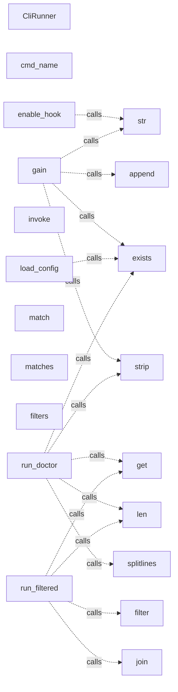

```mermaid
flowchart LR
  CliRunner["CliRunner"]
  append["append"]
  cmd_name["cmd_name"]
  enable_hook["enable_hook"]
  exists["exists"]
  filter["filter"]
  gain["gain"]
  get["get"]
  invoke["invoke"]
  join["join"]
  len["len"]
  load_config["load_config"]
  match["match"]
  matches["matches"]
  pytk_filters["filters"]
  run_doctor["run_doctor"]
  run_filtered["run_filtered"]
  splitlines["splitlines"]
  str["str"]
  strip["strip"]

  enable_hook -.->|calls| str
  gain -.->|calls| append
  gain -.->|calls| exists
  gain -.->|calls| str
  gain -.->|calls| strip
  load_config -.->|calls| exists
  run_doctor -.->|calls| exists
  run_doctor -.->|calls| get
  run_doctor -.->|calls| len
  run_doctor -.->|calls| splitlines
  run_doctor -.->|calls| strip
  run_filtered -.->|calls| filter
  run_filtered -.->|calls| get
  run_filtered -.->|calls| join
  run_filtered -.->|calls| len

```
