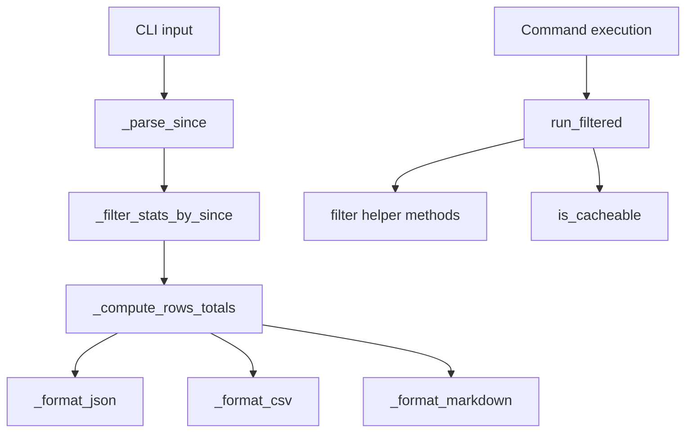

# Transformation Algorithms in `pytk`

This page documents the non-trivial transformation logic in the package: how CLI input is normalized, how command output is filtered and compressed, how aggregated rows are computed and formatted, and how cacheability decisions are made. The focus is on the observable algorithms in [`src/pytk/cli.py`](src/pytk/cli.py), [`src/pytk/cache.py`](src/pytk/cache.py), and the reduction helpers in the filter modules under [`src/pytk/filters/`](src/pytk/filters/__init__.py). It intentionally avoids broader architecture and installation topics.

## Transformation Pipeline Overview

At a high level, the package performs a repeatable transformation pipeline:

1. Normalize CLI parameters into typed values.
2. Load cached stats or runtime output as needed.
3. Reduce raw command output through command-specific filters.
4. Aggregate results into rows and totals.
5. Emit a chosen presentation format.
6. Decide whether the command is eligible for caching.



The CLI path is centered in [`gain`](src/pytk/cli.py#L207) and the execution path is centered in [`run_filtered`](src/pytk/runner.py#L31). The important thing to note is that both are “reduction-oriented”: they remove noise, collapse detail, or derive summary data from more verbose inputs.

> **Sources:** `src/pytk/cli.py` · L20–L122 · [`_parse_since`](src/pytk/cli.py#L20), [`_filter_stats_by_since`](src/pytk/cli.py#L36), [`_compute_rows_totals`](src/pytk/cli.py#L57), [`_format_json`](src/pytk/cli.py#L92), [`_format_csv`](src/pytk/cli.py#L102), [`_format_markdown`](src/pytk/cli.py#L112)

## Parsing and Normalizing CLI Input

The main parsing logic for the statistics workflow lives in [`_parse_since`](src/pytk/cli.py#L20). Its purpose is to convert a user-provided `since` string into a datetime cutoff that downstream filters can compare against.

### What `_parse_since` accepts

The function is documented to accept values such as:

- relative day windows like `7d`, `30d`, `1d`
- an absolute date like `YYYY-MM-DD`

The algorithm is straightforward but subtle because it supports two input families and must reject malformed values consistently.

### Stepwise behavior

Pseudocode:

```text
function _parse_since(since_str):
    trim whitespace
    if value ends with "d" and the prefix is digits:
        parse integer days
        return now() - timedelta(days=days)
    else:
        try to parse YYYY-MM-DD
        return datetime at the start of that day
    if parsing fails:
        raise Click BadParameter
```

A few implementation details are evidenced by relationships from [`_parse_since`](src/pytk/cli.py#L20):

- it uses string trimming before interpretation
- it branches on `endswith("d")`
- it checks numeric day counts with `isdigit()`
- it constructs relative cutoffs with `timedelta`
- it parses date literals with `strptime`
- it normalizes date cutoffs using `replace`
- it raises `BadParameter` on invalid input

This is not just input validation: it is canonicalization. The goal is to ensure every later timestamp comparison is against a single consistent cutoff type.

> **Sources:** `src/pytk/cli.py` · L20–L33 · [`_parse_since`](src/pytk/cli.py#L20)

## Filtering and Compressing Command Output

The package uses multiple filter helper methods to reduce output volume while keeping the salient information. These reducers are spread across concrete filters, but they all follow the same general strategy: strip noise, keep summary lines, and preserve errors or important status messages.

The filter base class is [`BaseFilter`](src/pytk/filters/base.py#L24), which defines the expected interface through [`BaseFilter.matches`](src/pytk/filters/base.py#L26) and [`BaseFilter.filter`](src/pytk/filters/base.py#L30). Concrete reducers such as [`GitFilter`](src/pytk/filters/git.py#L5), [`DockerFilter`](src/pytk/filters/docker.py#L6), [`GrepFilter`](src/pytk/filters/grep.py#L10), [`LintFilter`](src/pytk/filters/lint.py#L5), and others implement the actual compression logic.

### Common reduction patterns

Across filters, the same kinds of transformation show up repeatedly:

- remove ANSI escape sequences with [`strip_ansi`](src/pytk/filters/base.py#L8)
- drop known progress lines, step lines, or headers
- truncate long outputs to the first/last `N` lines
- group repeated messages or similar records
- preserve warnings and errors even when summary lines are compressed
- collapse structured output into a smaller representation

### Example reducer pseudocode

```text
function filter(output, cmd):
    output = strip_ansi(output)
    split output into lines
    remove lines that match noise patterns
    keep lines with warnings/errors/status
    maybe truncate to a configured limit
    maybe group repeated entries
    join lines back together
```

This “reduction by selective retention” is the core algorithmic idea behind the package. It is also why the cache decision logic matters: verbose outputs are only worth caching if the command is a good candidate for repeat reuse.

### Notable helper methods that perform reduction

The analysis shows a number of internal filter helpers explicitly designed for shrinking outputs:

| Module | Reduction helper | Main reduction strategy |
|---|---|---|
| [`CargoFilter`](src/pytk/filters/cargo.py#L5) | [`_filter_build`](src/pytk/filters/cargo.py#L25) | remove build chatter, preserve errors and final artifact details |
| [`CargoFilter`](src/pytk/filters/cargo.py#L5) | [`_filter_test`](src/pytk/filters/cargo.py#L79) | suppress passing tests |
| [`CargoFilter`](src/pytk/filters/cargo.py#L5) | [`_filter_clippy`](src/pytk/filters/cargo.py#L88) | suppress checking noise |
| [`CargoFilter`](src/pytk/filters/cargo.py#L5) | [`_filter_add_update`](src/pytk/filters/cargo.py#L99) | keep relevant package additions/updates |
| [`CargoFilter`](src/pytk/filters/cargo.py#L5) | [`_filter_run`](src/pytk/filters/cargo.py#L131) | strip build lines from run output |
| [`CurlFilter`](src/pytk/filters/curl.py#L6) | [`_filter_curl`](src/pytk/filters/curl.py#L21) | reduce verbose HTTP traces |
| [`CurlFilter`](src/pytk/filters/curl.py#L6) | [`_maybe_truncate_json`](src/pytk/filters/curl.py#L81) | compact JSON responses |
| [`CurlFilter`](src/pytk/filters/curl.py#L6) | [`_filter_httpie`](src/pytk/filters/curl.py#L100) | strip HTTPie request noise |
| [`CurlFilter`](src/pytk/filters/curl.py#L6) | [`_filter_wget`](src/pytk/filters/curl.py#L122) | strip progress output |
| [`DockerFilter`](src/pytk/filters/docker.py#L6) | [`_filter_logs`](src/pytk/filters/docker.py#L81) | strip ANSI, deduplicate, truncate |
| [`DockerFilter`](src/pytk/filters/docker.py#L6) | [`_filter_build`](src/pytk/filters/docker.py#L106) | strip build steps and cache lines |
| [`DockerFilter`](src/pytk/filters/docker.py#L6) | [`_filter_compose_action`](src/pytk/filters/docker.py#L143) | compress compose events to status summaries |
| [`DockerFilter`](src/pytk/filters/docker.py#L6) | [`_filter_inspect`](src/pytk/filters/docker.py#L172) | compress inspection JSON into a small summary |
| [`GitFilter`](src/pytk/filters/git.py#L5) | [`_compress_msg`](src/pytk/filters/git.py#L62) | strip ref decorations and shorten commit messages |
| [`GitFilter`](src/pytk/filters/git.py#L5) | [`_filter_status`](src/pytk/filters/git.py#L23) | keep meaningful status entries |
| [`GitFilter`](src/pytk/filters/git.py#L5) | [`_filter_diff`](src/pytk/filters/git.py#L46) | remove index-only noise |
| [`GitFilter`](src/pytk/filters/git.py#L5) | [`_filter_log`](src/pytk/filters/git.py#L70) | compress log entries |
| [`GrepFilter`](src/pytk/filters/grep.py#L10) | [`filter`](src/pytk/filters/grep.py#L15) | group and cap match output |
| [`LsFilter`](src/pytk/filters/ls.py#L7) | [`_filter_ls`](src/pytk/filters/ls.py#L25) | remove permissions/total lines |
| [`LsFilter`](src/pytk/filters/ls.py#L7) | [`_truncate`](src/pytk/filters/ls.py#L49) | keep head/tail of long listings |
| [`MakeFilter`](src/pytk/filters/make.py#L5) | [`filter`](src/pytk/filters/make.py#L10) | suppress directory-enter/leave chatter |
| [`NpmFilter`](src/pytk/filters/npm.py#L5) | [`_filter_install`](src/pytk/filters/npm.py#L30) | remove install progress noise |
| [`NpmFilter`](src/pytk/filters/npm.py#L5) | [`_filter_run`](src/pytk/filters/npm.py#L53) | remove run headers |
| [`NpmFilter`](src/pytk/filters/npm.py#L5) | [`_filter_audit`](src/pytk/filters/npm.py#L76) | keep audit summary |
| [`PoetryFilter`](src/pytk/filters/poetry.py#L5) | [`_filter_install`](src/pytk/filters/poetry.py#L23) | keep installation outcome, drop noise |
| [`PackageManagerFilter`](src/pytk/filters/package_manager.py#L5) | [`filter`](src/pytk/filters/package_manager.py#L12) | remove download progress and build chatter |
| [`TerraformFilter`](src/pytk/filters/terraform.py#L5) | [`filter`](src/pytk/filters/terraform.py#L12) | strip refresh/status noise |
| [`TestFilter`](src/pytk/filters/test.py#L7) | [`filter`](src/pytk/filters/test.py#L26) | suppress passing test lines and keep failures |

### Important observation

Although the helper names differ, they all embody the same reduction principle: preserve semantic signal, discard repetitive or mechanical noise. That consistency is what makes the package’s output compression predictable across commands.

> **Sources:** `src/pytk/filters/base.py` · L8–L35 · [`strip_ansi`](src/pytk/filters/base.py#L8), [`cmd_name`](src/pytk/filters/base.py#L13), [`BaseFilter`](src/pytk/filters/base.py#L24); `src/pytk/filters/cargo.py` · L5–L145 · [`CargoFilter._filter_build`](src/pytk/filters/cargo.py#L25), [`CargoFilter._filter_test`](src/pytk/filters/cargo.py#L79), [`CargoFilter._filter_clippy`](src/pytk/filters/cargo.py#L88), [`CargoFilter._filter_add_update`](src/pytk/filters/cargo.py#L99), [`CargoFilter._filter_run`](src/pytk/filters/cargo.py#L131); `src/pytk/filters/curl.py` · L6–L142 · [`CurlFilter._filter_curl`](src/pytk/filters/curl.py#L21), [`CurlFilter._maybe_truncate_json`](src/pytk/filters/curl.py#L81), [`CurlFilter._filter_httpie`](src/pytk/filters/curl.py#L100), [`CurlFilter._filter_wget`](src/pytk/filters/curl.py#L122); `src/pytk/filters/docker.py` · L6–L207 · [`DockerFilter._filter_logs`](src/pytk/filters/docker.py#L81), [`DockerFilter._filter_build`](src/pytk/filters/docker.py#L106), [`DockerFilter._filter_compose_action`](src/pytk/filters/docker.py#L143), [`DockerFilter._filter_inspect`](src/pytk/filters/docker.py#L172); `src/pytk/filters/git.py` · L5–L124 · [`GitFilter._compress_msg`](src/pytk/filters/git.py#L62), [`GitFilter._filter_status`](src/pytk/filters/git.py#L23), [`GitFilter._filter_diff`](src/pytk/filters/git.py#L46), [`GitFilter._filter_log`](src/pytk/filters/git.py#L70); `src/pytk/filters/grep.py` · L10–L74 · [`GrepFilter.filter`](src/pytk/filters/grep.py#L15); `src/pytk/filters/ls.py` · L7–L62 · [`LsFilter._filter_ls`](src/pytk/filters/ls.py#L25), [`LsFilter._truncate`](src/pytk/filters/ls.py#L49); `src/pytk/filters/make.py` · L5–L29 · [`MakeFilter.filter`](src/pytk/filters/make.py#L10); `src/pytk/filters/npm.py` · L5–L127 · [`NpmFilter._filter_install`](src/pytk/filters/npm.py#L30), [`NpmFilter._filter_run`](src/pytk/filters/npm.py#L53), [`NpmFilter._filter_audit`](src/pytk/filters/npm.py#L76); `src/pytk/filters/package_manager.py` · L5–L45 · [`PackageManagerFilter.filter`](src/pytk/filters/package_manager.py#L12); `src/pytk/filters/poetry.py` · L5–L35 · [`PoetryFilter._filter_install`](src/pytk/filters/poetry.py#L23); `src/pytk/filters/terraform.py` · L5–L37 · [`TerraformFilter.filter`](src/pytk/filters/terraform.py#L12); `src/pytk/filters/test.py` · L7–L118 · [`TestFilter.filter`](src/pytk/filters/test.py#L26)

## Row Computation and Totals

Once filtered stat records are selected, [`_compute_rows_totals`](src/pytk/cli.py#L57) converts them into display rows and a totals summary. This function is the data-shaping core of the `gain` command.

### Algorithmic intent

The function computes two things at once:

- per-command aggregated rows
- a grand-total summary for the selected period

The analysis shows it uses a [`defaultdict`](src/pytk/cli.py#L57) to group records, then sorts the keys and iterates deterministically. This matters because a summary report should be stable across runs, not dependent on input ordering.

### Stepwise behavior

Pseudocode:

```text
function _compute_rows_totals(records):
    group records by command name
    for each command group in sorted order:
        derive:
            runs = number of matching records
            before = sum of pre-filter token counts
            after = sum of post-filter token counts
            saved = before - after
            pct = saved / before
        append a row for the command

    compute totals across all records:
        total_runs
        total_before
        total_after
        total_saved
        total_pct
    return rows, totals
```

### Why the totals logic is non-trivial

The totals are not just sums of visible rows. The function also incorporates cached or derived counts from the stats records via repeated `get` lookups, indicating that the raw record schema stores multiple metrics per run. The function rounds percentage calculations with `round`, which makes the output presentation-friendly but also implies that the exact internal arithmetic is higher precision than the final table.

### Practical consequence

This aggregation stage defines the semantics of “savings.” A row is not merely a command label; it is a compressed report of repeated execution behavior over time. That is why row computation is the bridge between low-level execution stats and human-readable reporting.

> **Sources:** `src/pytk/cli.py` · L57–L89 · [`_compute_rows_totals`](src/pytk/cli.py#L57)

## Output Formatting: JSON, CSV, and Markdown

The formatting helpers are thin wrappers around the aggregated rows and totals, but they are still important because they encode different serialization strategies.

### `_format_json`

[`_format_json`](src/pytk/cli.py#L92) serializes the computed data structure into a JSON payload. The relationships show it uses `dumps`, `now`, and `strftime`, so the output likely embeds a timestamp/period label alongside rows and totals.

Use this formatter when the consumer needs structured output for tooling, scripting, or downstream ingestion.

### `_format_csv`

[`_format_csv`](src/pytk/cli.py#L102) is a classic streaming serializer built around `StringIO` and `writer`. It writes a header row and then emits one row per result, followed by totals. The key algorithmic point is that CSV output must be flattened: nested structures are converted into a row-oriented sequence.

### `_format_markdown`

[`_format_markdown`](src/pytk/cli.py#L112) builds a list of text lines and joins them into a Markdown document. Compared to CSV, it encodes more presentation semantics directly:

- table-like formatting
- human-readable summary labels
- no explicit schema metadata

### Comparison table

| Formatter | Primary shape | Strategy | Best for |
|---|---|---|---|
| [`_format_json`](src/pytk/cli.py#L92) | structured object | direct serialization | automation and machine consumption |
| [`_format_csv`](src/pytk/cli.py#L102) | flat table | row writer into buffer | spreadsheets and tabular pipelines |
| [`_format_markdown`](src/pytk/cli.py#L112) | prose + table | string assembly | terminal or docs-friendly output |

### Design implication

All three formatters consume the same canonical intermediate representation from `_compute_rows_totals`. That separation is important: computation happens once, presentation changes late.

> **Sources:** `src/pytk/cli.py` · L92–L122 · [`_format_json`](src/pytk/cli.py#L92), [`_format_csv`](src/pytk/cli.py#L102), [`_format_markdown`](src/pytk/cli.py#L112)

## Cache Decision Logic

Cacheability is handled by [`is_cacheable`](src/pytk/cache.py#L10), which is used by [`run_filtered`](src/pytk/runner.py#L31) before deciding whether to persist command output.

### Core intent

The function’s job is to classify commands into cache-friendly or cache-hostile categories. The analysis shows it works by inspecting the command name and applying string-based checks after normalization via `strip` and `split`.

This is a policy function, not just a utility. It governs whether command execution results can be reused safely.

### Decision model

Pseudocode:

```text
function is_cacheable(command):
    normalize command
    inspect command name
    return true if command belongs to a cache-friendly family
    otherwise return false
```

The tests confirm the intended policy shape:

- [`test_is_cacheable_git`](tests/test_cache.py#L17) and [`test_is_cacheable_ls`](tests/test_cache.py#L21) expect positive cases
- [`test_not_cacheable_docker`](tests/test_cache.py#L25) and [`test_not_cacheable_npm`](tests/test_cache.py#L29) expect negative cases

That tells us the cache policy is selective, not universal. The package treats some command families as stable enough for caching and others as too dynamic or side-effectful.

### Interaction with execution

[`run_filtered`](src/pytk/runner.py#L31) consults [`is_cacheable`](src/pytk/cache.py#L10) as part of its execution flow. The important algorithmic consequence is:

1. run command or use cache
2. filter the output
3. decide whether the result should be stored
4. skip cache storage for non-cacheable commands

This means the transformation pipeline affects caching in both directions: cache lookup prevents re-execution, and cacheability prevents polluting the cache with unsuitable outputs.

> **Sources:** `src/pytk/cache.py` · L10–L12 · [`is_cacheable`](src/pytk/cache.py#L10); `src/pytk/runner.py` · L31–L90 · [`run_filtered`](src/pytk/runner.py#L31); `tests/test_cache.py` · L17–L30 · [`test_is_cacheable_git`](tests/test_cache.py#L17), [`test_is_cacheable_ls`](tests/test_cache.py#L21), [`test_not_cacheable_docker`](tests/test_cache.py#L25), [`test_not_cacheable_npm`](tests/test_cache.py#L29)

## End-to-End Call Chain

The `gain` reporting path and the filtered execution path share the same transformation mindset, but they operate on different inputs.

### Reporting path

```text
gain → _parse_since → _filter_stats_by_since → _compute_rows_totals → _format_*
```

### Execution path

```text
run_filtered → get_filter → filter helper method(s) → is_cacheable → cache set/get
```

The second chain is especially important because it explains where output reduction happens. The command-specific filter helpers are the core reducers; the cache decision is the gatekeeper that determines whether reduced output is stored for reuse.

> **Sources:** `src/pytk/cli.py` · L20–L122 · [`gain`](src/pytk/cli.py#L207), [`_parse_since`](src/pytk/cli.py#L20), [`_filter_stats_by_since`](src/pytk/cli.py#L36), [`_compute_rows_totals`](src/pytk/cli.py#L57), [`_format_json`](src/pytk/cli.py#L92), [`_format_csv`](src/pytk/cli.py#L102), [`_format_markdown`](src/pytk/cli.py#L112); `src/pytk/runner.py` · L31–L90 · [`run_filtered`](src/pytk/runner.py#L31); `src/pytk/cache.py` · L10–L26 · [`is_cacheable`](src/pytk/cache.py#L10), [`get`](src/pytk/cache.py#L15), [`set`](src/pytk/cache.py#L25)