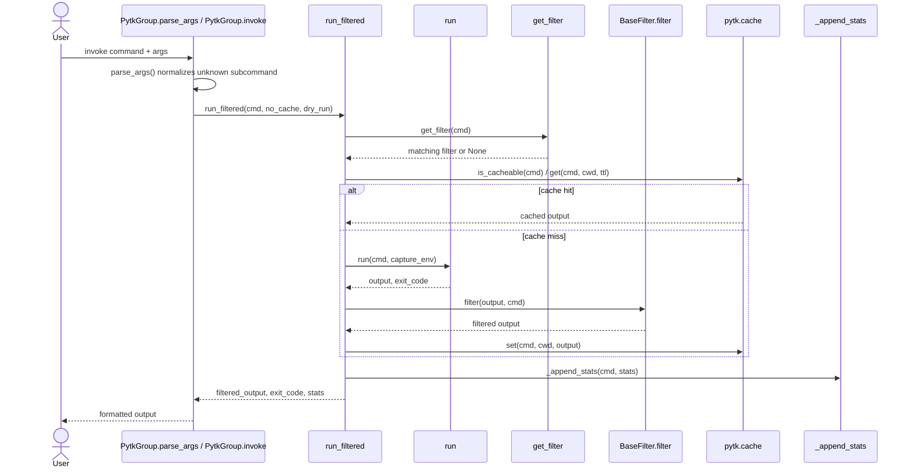

# Command Data Flow Through the Pipeline

## Overview

When a command is invoked, the application follows a short but layered pipeline:

1. CLI argument parsing routes the invocation into either a built-in command or the command-filtering path.
2. The command is matched against registered filters via [`get_filter`](src/pytk/filters/registry.py#L22).
3. If a filter matches, [`run_filtered`](src/pytk/runner.py#L31) executes the command through [`run`](src/pytk/runner.py#L15), applies the filter’s [`filter`](src/pytk/filters/base.py#L30) method, and optionally updates cache/statistics.
4. Output is finally emitted by the CLI layer, either as raw text for passthrough-like flows or as structured tabular / JSON / CSV / Markdown output in reporting commands such as [`gain`](src/pytk/cli.py#L207).

The codebase is intentionally split so that the CLI layer handles user-facing orchestration, the runner handles execution and persistence, and the filter implementations perform command-specific text reduction. The shared filter contract comes from [`BaseFilter`](src/pytk/filters/base.py#L24), whose subclasses implement command detection and transformation logic.

The most important observable path for command execution is:

`PytkGroup.parse_args` → `PytkGroup.invoke` → `run_filtered` → `run` → `get_filter` → `Filter.filter` → cache/statistics update

For filter-based commands, the command string is first normalized using [`cmd_name`](src/pytk/filters/base.py#L13) and then dispatched to a concrete filter such as [`GitFilter`](src/pytk/filters/git.py#L5), [`LsFilter`](src/pytk/filters/ls.py#L7), or [`DockerFilter`](src/pytk/filters/docker.py#L6).

> **Sources:** `src/pytk/cli.py` · `src/pytk/runner.py` · `src/pytk/filters/base.py` · `src/pytk/filters/registry.py`

## End-to-End Sequence

The diagram below shows the main execution path, including argument parsing, filter matching, transformation, output formatting, and cache/statistics updates.

The key detail is that caching sits between command execution and output transformation: [`run_filtered`](src/pytk/runner.py#L31) checks [`is_cacheable`](src/pytk/cache.py#L10) and consults [`get`](src/pytk/cache.py#L15) before invoking the external process via [`run`](src/pytk/runner.py#L15). After filtering, it may persist the result using [`set`](src/pytk/cache.py#L25). Separately, statistics are appended through [`_append_stats`](src/pytk/runner.py#L93), which is the write path backing the `gain` command.

> **Sources:** `src/pytk/cli.py` · `src/pytk/runner.py` · `src/pytk/cache.py` · `src/pytk/filters/registry.py`

## Argument Parsing and Command Routing

The CLI entrypoint is [`main`](src/pytk/cli.py#L185), which is built on Click and registers the command group [`PytkGroup`](src/pytk/cli.py#L125). The custom [`PytkGroup.parse_args`](src/pytk/cli.py#L128) method preserves unknown subcommands so the application can intercept them instead of failing early. That design is what enables the “proxy any command” behavior.

Inside [`PytkGroup.invoke`](src/pytk/cli.py#L149), built-in commands are handled normally, while unknown commands are routed into [`run_filtered`](src/pytk/runner.py#L31). The `passthrough` command is an explicit escape hatch implemented by [`passthrough`](src/pytk/cli.py#L596), which calls [`run`](src/pytk/runner.py#L15) directly and skips filtering.

The routing logic is therefore:

- Built-in administrative command: CLI function executes directly.
- Unknown external command: routed to `run_filtered`.
- Explicit passthrough: routed to `run`.

This separation is important because the parsing layer does not itself perform output compression; it only decides which execution path should own the command.

> **Sources:** `src/pytk/cli.py` · [`PytkGroup.parse_args`](src/pytk/cli.py#L128) · [`PytkGroup.invoke`](src/pytk/cli.py#L149) · [`main`](src/pytk/cli.py#L185) · [`passthrough`](src/pytk/cli.py#L596)

## Filter Matching and Transformation

Filter selection is centralized in [`get_filter`](src/pytk/filters/registry.py#L22). The registry imports concrete filter modules such as [`GitFilter`](src/pytk/filters/git.py#L5), [`GrepFilter`](src/pytk/filters/grep.py#L10), [`LsFilter`](src/pytk/filters/ls.py#L7), and many others. Each implementation inherits from [`BaseFilter`](src/pytk/filters/base.py#L24) and must define at least:

- [`matches(self, cmd)`](src/pytk/filters/base.py#L26)
- [`filter(self, output, cmd)`](src/pytk/filters/base.py#L30)
- [`savings_example(self)`](src/pytk/filters/base.py#L33)

Matching is done with `cmd_name`, which strips the executable path from `cmd[0]`. For example, `GitFilter.matches` and `LsFilter.matches` both use [`cmd_name`](src/pytk/filters/base.py#L13) to decide whether they apply to the incoming command. Once a filter is chosen, its `filter` method receives the raw output and command vector and is responsible for compressing noise, stripping ANSI escapes with [`strip_ansi`](src/pytk/filters/base.py#L8), and preserving only informative lines.

Concrete examples from the pipeline:

- [`GitFilter.filter`](src/pytk/filters/git.py#L10) dispatches to specialized helpers like [`_filter_status`](src/pytk/filters/git.py#L23) and [`_filter_log`](src/pytk/filters/git.py#L70).
- [`DockerFilter.filter`](src/pytk/filters/docker.py#L11) chooses among [`_filter_ps`](src/pytk/filters/docker.py#L39), [`_filter_logs`](src/pytk/filters/docker.py#L81), or [`_filter_inspect`](src/pytk/filters/docker.py#L172).
- [`GrepFilter.filter`](src/pytk/filters/grep.py#L15) groups repeated file hits and trims large result sets.
- [`TestFilter.filter`](src/pytk/filters/test.py#L26) suppresses passing test noise while keeping failures and summaries.

The structure is always the same: a fast matcher followed by a command-specific transformer.

> **Sources:** `src/pytk/filters/base.py` · `src/pytk/filters/registry.py` · `src/pytk/filters/git.py` · `src/pytk/filters/docker.py` · `src/pytk/filters/grep.py` · `src/pytk/filters/test.py` · `src/pytk/filters/ls.py`

## Caching and Statistics Aggregation

The cache API in [`pytk.cache`](src/pytk/cache.py#L1) is small but central to repeated command invocations. [`is_cacheable`](src/pytk/cache.py#L10) decides whether a command should be cached at all. [`get`](src/pytk/cache.py#L15) returns a cached entry if it is still valid, while [`set`](src/pytk/cache.py#L25) stores a fresh result keyed by command and working directory. [`clear`](src/pytk/cache.py#L29) and [`size`](src/pytk/cache.py#L33) provide maintenance and inspection primitives.

The runner layer uses cache state as a performance shortcut:

- if a command is cacheable and the entry exists, output can be reused;
- if not, [`run`](src/pytk/runner.py#L15) is called and the result may be stored afterward.

Statistics are accumulated in [`_append_stats`](src/pytk/runner.py#L93), which writes records consumed later by [`gain`](src/pytk/cli.py#L207). The reporting pipeline uses helper functions in the CLI module:

- [`_parse_since`](src/pytk/cli.py#L20) interprets the time window.
- [`_filter_stats_by_since`](src/pytk/cli.py#L36) restricts records to a reporting period.
- [`_compute_rows_totals`](src/pytk/cli.py#L57) aggregates per-command rows and totals.
- [`_format_json`](src/pytk/cli.py#L92), [`_format_csv`](src/pytk/cli.py#L102), and [`_format_markdown`](src/pytk/cli.py#L112) render the final report.

In other words, cache is optimized for execution reuse, while statistics aggregation is optimized for later analysis. They are separate subsystems but both are fed from the command execution pipeline.

> **Sources:** `src/pytk/cache.py` · [`is_cacheable`](src/pytk/cache.py#L10) · [`get`](src/pytk/cache.py#L15) · [`set`](src/pytk/cache.py#L25) · [`clear`](src/pytk/cache.py#L29) · [`size`](src/pytk/cache.py#L33) · `src/pytk/runner.py` · [`_append_stats`](src/pytk/runner.py#L93) · `src/pytk/cli.py` · [`gain`](src/pytk/cli.py#L207)

## Input-to-Output Mapping

The table below maps the main inputs to their outputs along the command pipeline.

| Input / Stage | Representative Symbol | Input Shape | Output Shape | Notes |
|---|---|---|---|---|
| CLI command invocation | [`PytkGroup.invoke`](src/pytk/cli.py#L149) | raw argv + Click context | dispatch decision | Routes to built-in command, passthrough, or [`run_filtered`](src/pytk/runner.py#L31) |
| Filter match | [`BaseFilter.matches`](src/pytk/filters/base.py#L26) / [`get_filter`](src/pytk/filters/registry.py#L22) | `cmd: list[str]` | selected filter instance or `None` | Uses [`cmd_name`](src/pytk/filters/base.py#L13) in concrete filters |
| Filtering / transformation | [`GitFilter.filter`](src/pytk/filters/git.py#L10), [`DockerFilter.filter`](src/pytk/filters/docker.py#L11), [`TestFilter.filter`](src/pytk/filters/test.py#L26) | raw command output text + command | reduced output text | May normalize ANSI, truncate, group, or compress lines |
| Cache lookup | [`get`](src/pytk/cache.py#L15) | command + cwd + ttl | cached output or miss | Used before expensive execution, only when [`is_cacheable`](src/pytk/cache.py#L10) is true |
| Cache write | [`set`](src/pytk/cache.py#L25) | command + cwd + filtered/raw output | persisted cache entry | Called after successful filtered execution |
| Statistics aggregation | [`_append_stats`](src/pytk/runner.py#L93) | command + stats payload | updated stats file | Consumed by [`gain`](src/pytk/cli.py#L207) |
| Report formatting | [`_format_json`](src/pytk/cli.py#L92) / [`_format_csv`](src/pytk/cli.py#L102) / [`_format_markdown`](src/pytk/cli.py#L112) | aggregated rows + totals | JSON / CSV / Markdown text | Final presentation layer for command savings |

This mapping shows the pipeline’s stable contract: commands enter as argument vectors, are matched to filters, transformed into smaller outputs, and then either cached or summarized for later reporting.

> **Sources:** `src/pytk/cli.py` · `src/pytk/runner.py` · `src/pytk/cache.py` · `src/pytk/filters/base.py` · `src/pytk/filters/registry.py` · `src/pytk/filters/git.py` · `src/pytk/filters/docker.py` · `src/pytk/filters/test.py`

## Practical Flow Summary

For a typical external command, the observable path is:

1. [`PytkGroup.parse_args`](src/pytk/cli.py#L128) preserves the command.
2. [`PytkGroup.invoke`](src/pytk/cli.py#L149) forwards it to [`run_filtered`](src/pytk/runner.py#L31).
3. [`get_filter`](src/pytk/filters/registry.py#L22) chooses a concrete subclass of [`BaseFilter`](src/pytk/filters/base.py#L24).
4. [`run`](src/pytk/runner.py#L15) executes the process if no valid cache entry exists.
5. The filter’s [`filter`](src/pytk/filters/base.py#L30) implementation rewrites the output.
6. [`set`](src/pytk/cache.py#L25) may persist the result, and [`_append_stats`](src/pytk/runner.py#L93) records usage metrics.
7. Downstream reporting commands like [`gain`](src/pytk/cli.py#L207) turn those metrics into user-readable summaries via formatting helpers.

That is the core data flow: parse, match, execute, filter, cache, aggregate, format.

> **Sources:** `src/pytk/cli.py` · `src/pytk/runner.py` · `src/pytk/filters/registry.py` · `src/pytk/filters/base.py` · `src/pytk/cache.py`