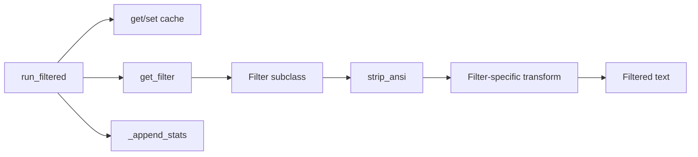
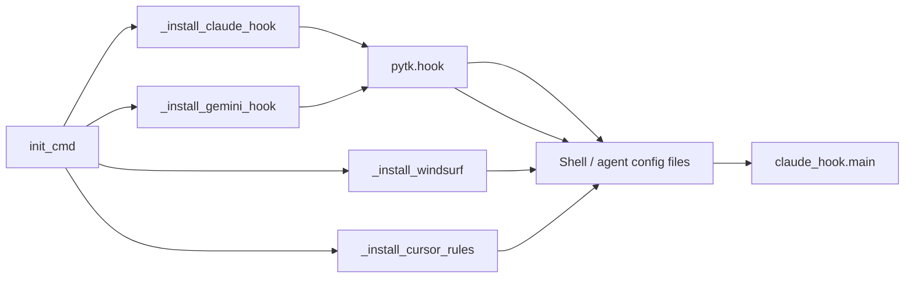

# CLI and Filter Framework Architecture

## Overview

The `pytk` CLI is a command proxy that intercepts shell commands, chooses a specialized output filter, and then emits a shortened result suitable for LLM consumption. The architecture is centered on three cooperating layers:

1. **CLI entry and dispatch** in [`main`](src/pytk/cli.py#L185) and [`PytkGroup`](src/pytk/cli.py#L125).
2. **Execution and filtering** in [`run_filtered`](src/pytk/runner.py#L31) and the filter registry in [`get_filter`](src/pytk/filters/registry.py#L22).
3. **Filter implementations** built on [`BaseFilter`](src/pytk/filters/base.py#L24), with command-specific subclasses such as [`GitFilter`](src/pytk/filters/git.py#L5), [`DockerFilter`](src/pytk/filters/docker.py#L6), and [`TestFilter`](src/pytk/filters/test.py#L7).

A key design choice is that the CLI does not hard-code command handling logic in a giant switch statement. Instead, the [`PytkGroup`](src/pytk/cli.py#L125) Click group is customized to “fall through” to `run_filtered` for unknown subcommands, while the filter registry resolves the correct [`BaseFilter`](src/pytk/filters/base.py#L24) subclass based on the command name. This makes the system extensible without changing the main command surface.

### Main request/response flow

```mermaid
flowchart LR
  CLIArgs[CLI arguments]
  Main[main]
  Group[PytkGroup]
  Dispatch[Click command dispatch]
  RunFiltered[run_filtered]
  Registry[get_filter]
  Filter[BaseFilter subclass]
  Format[Formatted output]
  Stdout[Terminal stdout]

  CLIArgs --> Main --> Group --> Dispatch
  Dispatch -->|unknown subcommand| RunFiltered
  RunFiltered --> Registry --> Filter --> Format --> Stdout
```

> **Sources:** `src/pytk/cli.py` · L125–L200 · [`PytkGroup`](src/pytk/cli.py#L125), [`main`](src/pytk/cli.py#L185); `src/pytk/runner.py` · L31–L90 · [`run_filtered`](src/pytk/runner.py#L31); `src/pytk/filters/registry.py` · L22–L26 · [`get_filter`](src/pytk/filters/registry.py#L22)

## Component Responsibilities

### CLI layer

The CLI layer is responsible for defining the user-facing commands, parsing Click options, and routing either to built-in commands or to the proxy execution path. [`main`](src/pytk/cli.py#L185) is the root Click command group. Its docstring shows the intended user experience: invoke `pytk` directly for common commands, or use built-ins such as `gain`, `init`, `list-filters`, and `passthrough`.

The custom [`PytkGroup`](src/pytk/cli.py#L125) class is the architectural hinge. Its purpose is stated clearly in the docstring: “Click Group that falls through to run_filtered for unknown subcommands.” That means a shell command like `pytk git status` is not treated as an error; instead, it becomes the input to the execution/filter pipeline.

The built-in commands are also part of the architecture, but they are secondary to the proxy flow:
- [`gain`](src/pytk/cli.py#L207) reports token savings from stats history.
- [`init_cmd`](src/pytk/cli.py#L538) prints integration instructions and can drive hook installation.
- [`hook_enable`](src/pytk/cli.py#L713), [`hook_disable`](src/pytk/cli.py#L726), and [`hook_status_cmd`](src/pytk/cli.py#L739) manage shell hooks.
- [`passthrough`](src/pytk/cli.py#L596) is an escape hatch that runs a command without filtering.

### Runner layer

The runner module owns the execution lifecycle. [`run`](src/pytk/runner.py#L15) executes a subprocess and returns `(output, exit_code)`. [`run_filtered`](src/pytk/runner.py#L31) then adds the filter-aware behavior: it runs the command, selects a filter with [`get_filter`](src/pytk/filters/registry.py#L22), potentially uses cached output via [`get`](src/pytk/cache.py#L15), and stores execution statistics through [`_append_stats`](src/pytk/runner.py#L93).

This separation is important: the CLI is mostly a user-interface shell, while the runner is where the system enforces performance, caching, and output shaping.

### Filter framework

The filter framework is built around [`BaseFilter`](src/pytk/filters/base.py#L24), which defines the common interface:
- [`BaseFilter.matches`](src/pytk/filters/base.py#L26) decides whether the filter applies to a command.
- [`BaseFilter.filter`](src/pytk/filters/base.py#L30) compresses or rewrites output.
- [`BaseFilter.savings_example`](src/pytk/filters/base.py#L33) provides sample savings metadata for the `list-filters` command.

Concrete filters such as [`GitFilter`](src/pytk/filters/git.py#L5), [`CatFilter`](src/pytk/filters/cat.py#L9), [`CurlFilter`](src/pytk/filters/curl.py#L6), [`DockerFilter`](src/pytk/filters/docker.py#L6), [`GrepFilter`](src/pytk/filters/grep.py#L10), [`KubectlFilter`](src/pytk/filters/kubectl.py#L6), [`LintFilter`](src/pytk/filters/lint.py#L5), [`LsFilter`](src/pytk/filters/ls.py#L7), [`MakeFilter`](src/pytk/filters/make.py#L5), [`NpmFilter`](src/pytk/filters/npm.py#L5), [`PackageManagerFilter`](src/pytk/filters/package_manager.py#L5), [`PoetryFilter`](src/pytk/filters/poetry.py#L5), [`TerraformFilter`](src/pytk/filters/terraform.py#L5), [`TestFilter`](src/pytk/filters/test.py#L7), and [`UvFilter`](src/pytk/filters/uv.py#L5) all follow the same pattern: inspect the command, branch on subcommand, and emit a compact output.

> **Sources:** `src/pytk/cli.py` · L125–L200 · [`PytkGroup`](src/pytk/cli.py#L125), [`main`](src/pytk/cli.py#L185), [`gain`](src/pytk/cli.py#L207), [`init_cmd`](src/pytk/cli.py#L538), [`passthrough`](src/pytk/cli.py#L596), [`hook_enable`](src/pytk/cli.py#L713), [`hook_disable`](src/pytk/cli.py#L726), [`hook_status_cmd`](src/pytk/cli.py#L739); `src/pytk/runner.py` · L15–L104 · [`run`](src/pytk/runner.py#L15), [`run_filtered`](src/pytk/runner.py#L31), [`_append_stats`](src/pytk/runner.py#L93); `src/pytk/filters/base.py` · L24–L35 · [`BaseFilter`](src/pytk/filters/base.py#L24)

## Filter Selection and Output Formatting

The system’s central runtime decision is: “Which filter, if any, should process this command output?” That decision is delegated to [`get_filter`](src/pytk/filters/registry.py#L22), which imports all known filter modules from [`pytk.filters.__init__`](src/pytk/filters/__init__.py#L1) and routes based on each filter’s [`matches`](src/pytk/filters/base.py#L26) implementation.

From the analysis data, the registry is intentionally broad rather than hierarchical: each filter checks its own command family. For example:
- [`GitFilter.matches`](src/pytk/filters/git.py#L6) checks Git command names.
- [`DockerFilter.matches`](src/pytk/filters/docker.py#L7) checks Docker commands.
- [`TestFilter.matches`](src/pytk/filters/test.py#L8) checks test runner commands.
- [`UvFilter.filter`](src/pytk/filters/uv.py#L9) can delegate to another filter, showing that some filters are compositional rather than strictly one-pass.

The output formatting model is usually:
1. Strip ANSI sequences with [`strip_ansi`](src/pytk/filters/base.py#L8).
2. Split into lines.
3. Apply command-specific compaction rules.
4. Return a smaller text block.

For example, [`GitFilter.filter`](src/pytk/filters/git.py#L10) dispatches to internal helpers like `._filter_status`, `._filter_diff`, and `._filter_log`, while [`DockerFilter.filter`](src/pytk/filters/docker.py#L11) can route to `._filter_ps`, `._filter_images`, `._filter_logs`, `._filter_build`, `._filter_compose_action`, or `._filter_inspect`. Similarly, [`NpmFilter.filter`](src/pytk/filters/npm.py#L10) branches among install/run/audit/test/npx cases.

### Formatter path for CLI output

> **Sources:** `src/pytk/runner.py` · L31–L104 · [`run_filtered`](src/pytk/runner.py#L31), [`_append_stats`](src/pytk/runner.py#L93); `src/pytk/cache.py` · L10–L34 · [`get`](src/pytk/cache.py#L15), [`set`](src/pytk/cache.py#L25); `src/pytk/filters/base.py` · L8–L35 · [`strip_ansi`](src/pytk/filters/base.py#L8), [`BaseFilter`](src/pytk/filters/base.py#L24)

## Hook Installation and Hook Execution Path

The repository contains evidence for a hook-based command interception path, especially around Claude Code integration. The CLI exposes [`hook_enable`](src/pytk/cli.py#L713), [`hook_disable`](src/pytk/cli.py#L726), [`hook_status_cmd`](src/pytk/cli.py#L739), and [`hook_run_claude`](src/pytk/cli.py#L750), while the hook runtime itself lives in [`pytk.hooks.claude_hook`](src/pytk/hooks/claude_hook.py#L1) and the hook-management helpers are in [`pytk.hook`](src/pytk/hook.py#L1).

The hook path is structurally different from the normal CLI path:
- [`should_rewrite`](src/pytk/hooks/claude_hook.py#L25) decides whether a command should be prefixed with `pytk`.
- [`rewrite_command`](src/pytk/hooks/claude_hook.py#L38) performs that prefixing.
- [`main`](src/pytk/hooks/claude_hook.py#L43) reads JSON input, applies rewrite logic when appropriate, and prints JSON output.
- [`enable_hook`](src/pytk/hook.py#L90) writes shell configuration snippets.
- [`disable_hook`](src/pytk/hook.py#L109) removes those snippets.
- [`hook_status`](src/pytk/hook.py#L128) reports whether the integration is active.

The CLI installation commands support several integration targets. The analysis evidence explicitly shows:
- [`_install_windsurf`](src/pytk/cli.py#L323)
- [`_install_gemini_hook`](src/pytk/cli.py#L376)
- [`_install_claude_hook`](src/pytk/cli.py#L427)
- [`_install_cursor_rules`](src/pytk/cli.py#L519)

`init_cmd` orchestrates these installers based on the selected agent, so the hook-installation path is a first-class part of the architecture rather than an ad hoc script.

### Hook installation flow

> **Sources:** `src/pytk/cli.py` · L323–L591 · [`_install_windsurf`](src/pytk/cli.py#L323), [`_install_gemini_hook`](src/pytk/cli.py#L376), [`_install_claude_hook`](src/pytk/cli.py#L427), [`_install_cursor_rules`](src/pytk/cli.py#L519), [`init_cmd`](src/pytk/cli.py#L538); `src/pytk/hook.py` · L43–L136 · [`enable_hook`](src/pytk/hook.py#L90), [`disable_hook`](src/pytk/hook.py#L109), [`hook_status`](src/pytk/hook.py#L128); `src/pytk/hooks/claude_hook.py` · L25–L65 · [`should_rewrite`](src/pytk/hooks/claude_hook.py#L25), [`rewrite_command`](src/pytk/hooks/claude_hook.py#L38), [`main`](src/pytk/hooks/claude_hook.py#L43)

## Design Decisions

### Fall-through CLI dispatch instead of explicit command enumeration

The most visible design choice is the custom Click group [`PytkGroup`](src/pytk/cli.py#L125). Rather than requiring every proxied command to be declared as a subcommand, the CLI lets unknown commands fall through to the filter/execution pipeline. This is a strong ergonomic decision: users can write `pytk git status` or `pytk pytest tests/` without pre-registering those commands in the CLI grammar.

### Filter specialization over generic parsing

The filter framework is intentionally specialized. Each filter is responsible for a narrow command family, and the logic is embedded in methods like [`GitFilter._filter_status`](src/pytk/filters/git.py#L23), [`CurlFilter._filter_curl`](src/pytk/filters/curl.py#L21), or [`KubectlFilter._filter_describe`](src/pytk/filters/kubectl.py#L78). This makes filters easier to reason about and lets them be aggressively optimized for the output shape of the underlying tool.

### Shared normalization primitives

Despite the specialization, the framework still standardizes common behavior through [`BaseFilter`](src/pytk/filters/base.py#L24), especially [`strip_ansi`](src/pytk/filters/base.py#L8) and [`cmd_name`](src/pytk/filters/base.py#L13). That keeps repeated low-level concerns out of each concrete filter.

### Hook-driven automation as a first-class feature

Hook support is not a separate add-on; it is integrated into the main CLI under `init` and `hook` commands. That means command interception can be installed, queried, and removed using the same tool that provides filtering. The evidence also shows a dedicated hook runtime in [`claude_hook.main`](src/pytk/hooks/claude_hook.py#L43), which keeps agent-specific behavior isolated from the generic CLI.

> **Sources:** `src/pytk/cli.py` · L125–L200 · [`PytkGroup`](src/pytk/cli.py#L125), [`main`](src/pytk/cli.py#L185); `src/pytk/filters/base.py` · L8–L35 · [`strip_ansi`](src/pytk/filters/base.py#L8), [`cmd_name`](src/pytk/filters/base.py#L13), [`BaseFilter`](src/pytk/filters/base.py#L24); `src/pytk/hooks/claude_hook.py` · L25–L65 · [`should_rewrite`](src/pytk/hooks/claude_hook.py#L25), [`main`](src/pytk/hooks/claude_hook.py#L43)

## Extension Points

### Adding a new filter

The clearest extension point is the filter interface. To add support for a new command family, a developer creates a new `BaseFilter` subclass with:
- a `matches(self, cmd)` predicate,
- a `filter(self, output, cmd)` implementation,
- and optionally `savings_example(self)` for CLI reporting.

Then the filter module should be imported by [`pytk.filters.registry`](src/pytk/filters/registry.py#L1) so that [`get_filter`](src/pytk/filters/registry.py#L22) can discover it.

### Adding command-specific sub-dispatch inside a filter

Most of the existing filters already demonstrate the second-level extension pattern: a single filter can branch on subcommands and delegate to private helpers. Examples include [`NpmFilter`](src/pytk/filters/npm.py#L5), [`DockerFilter`](src/pytk/filters/docker.py#L6), and [`KubectlFilter`](src/pytk/filters/kubectl.py#L6). This pattern is likely the preferred way to expand support for a tool without creating a new top-level filter class for every subcommand.

### Adding a new agent integration

The CLI’s install surface suggests that new integrations can be added by extending the `init_cmd`/installer family in [`src/pytk/cli.py`](src/pytk/cli.py#L323). The existing helpers — [`_install_windsurf`](src/pytk/cli.py#L323), [`_install_gemini_hook`](src/pytk/cli.py#L376), [`_install_claude_hook`](src/pytk/cli.py#L427), and [`_install_cursor_rules`](src/pytk/cli.py#L519) — define the shape of these extensions.

### Hook behavior customization

Agent-specific command rewriting is isolated in [`pytk.hooks.claude_hook`](src/pytk/hooks/claude_hook.py#L1). The functions [`should_rewrite`](src/pytk/hooks/claude_hook.py#L25) and [`rewrite_command`](src/pytk/hooks/claude_hook.py#L38) are natural extension points if a future integration needs to recognize more command patterns or apply different rewrite rules.

> **Sources:** `src/pytk/filters/registry.py` · L1–L26 · [`get_filter`](src/pytk/filters/registry.py#L22); `src/pytk/filters/base.py` · L24–L35 · [`BaseFilter`](src/pytk/filters/base.py#L24); `src/pytk/cli.py` · L323–L591 · [`_install_windsurf`](src/pytk/cli.py#L323), [`_install_gemini_hook`](src/pytk/cli.py#L376), [`_install_claude_hook`](src/pytk/cli.py#L427), [`_install_cursor_rules`](src/pytk/cli.py#L519), [`init_cmd`](src/pytk/cli.py#L538); `src/pytk/hooks/claude_hook.py` · L25–L65 · [`should_rewrite`](src/pytk/hooks/claude_hook.py#L25), [`rewrite_command`](src/pytk/hooks/claude_hook.py#L38), [`main`](src/pytk/hooks/claude_hook.py#L43)

## Cross-Module Dependency Table

The table below summarizes the major architectural relationships visible in the analysis data.

| Module | Imports From | Called By | Calls Into | Inherits From |
|--------|-------------|-----------|------------|---------------|
| `pytk.cli` | `pytk.runner`, `pytk.filters.registry`, `pytk.config`, `pytk.hook`, `pytk.doctor`, `pytk.hooks.claude_hook` | CLI entrypoints and Click command execution | `run_filtered`, hook installers, config commands, doctor, filter listing | `click.Group` via [`PytkGroup`](src/pytk/cli.py#L125) |
| `pytk.runner` | `pytk.filters.registry`, `pytk.config`, `pytk.cache` | [`PytkGroup.invoke`](src/pytk/cli.py#L149), `passthrough`, dry-run tests | `run`, `get_filter`, `load_config`, cache helpers, stats append | — |
| `pytk.filters.registry` | all filter modules, `pytk.filters.base` | `run_filtered`, doctor, `PoetryFilter`, `UvFilter` | `matches` on concrete filters | — |
| `pytk.filters.base` | `abc`, `os`, `re` | all concrete filters | `strip_ansi`, `cmd_name` | `ABC` |
| `pytk.hook` | `os`, `re`, `pathlib`, `pytk.cache` | CLI hook commands, doctor | shell config file edits, status checks | — |
| `pytk.hooks.claude_hook` | `json`, `sys`, `pytk.cache` | Claude hook runtime, CLI hook tests | command rewrite decision and JSON output | — |

> **Sources:** `src/pytk/cli.py` · L1–L753; `src/pytk/runner.py` · L1–L104; `src/pytk/filters/registry.py` · L1–L26; `src/pytk/filters/base.py` · L1–L35; `src/pytk/hook.py` · L1–L136; `src/pytk/hooks/claude_hook.py` · L1–L65

## Module Coupling

### Tightly coupled pairs

The strongest coupling is between:
- [`pytk.cli`](src/pytk/cli.py#L1) and [`pytk.runner`](src/pytk/runner.py#L1), because CLI dispatch directly funnels into `run_filtered`.
- [`pytk.runner`](src/pytk/runner.py#L1) and [`pytk.filters.registry`](src/pytk/filters/registry.py#L1), because command selection depends on registry lookup.
- [`pytk.filters.registry`](src/pytk/filters/registry.py#L1) and the concrete filter modules, because the registry imports the full filter set to make dispatch possible.

### Looser or more isolated components

The most isolated components are:
- [`scripts.benchmark`](scripts/benchmark.py#L1), which is a standalone benchmarking helper and not part of runtime dispatch.
- [`pytk.hooks.claude_hook`](src/pytk/hooks/claude_hook.py#L1), which is specialized to hook runtime JSON processing and remains separate from the main CLI proxy.
- [`pytk.doctor`](src/pytk/doctor.py#L1), which is operational/diagnostic rather than part of core filtering.

### Circular dependency concerns

No explicit circular dependency is evidenced in the relationship data. The design appears intentionally layered so that:
- CLI depends on runner,
- runner depends on registry and config,
- registry depends on filters,
- filters depend on base/config/cache.

That directionality reduces the risk of cyclic import pressure.

> **Sources:** `src/pytk/cli.py` · L1–L753; `src/pytk/runner.py` · L1–L104; `src/pytk/filters/registry.py` · L1–L26; `src/pytk/doctor.py` · L1–L112; `src/pytk/hooks/claude_hook.py` · L1–L65