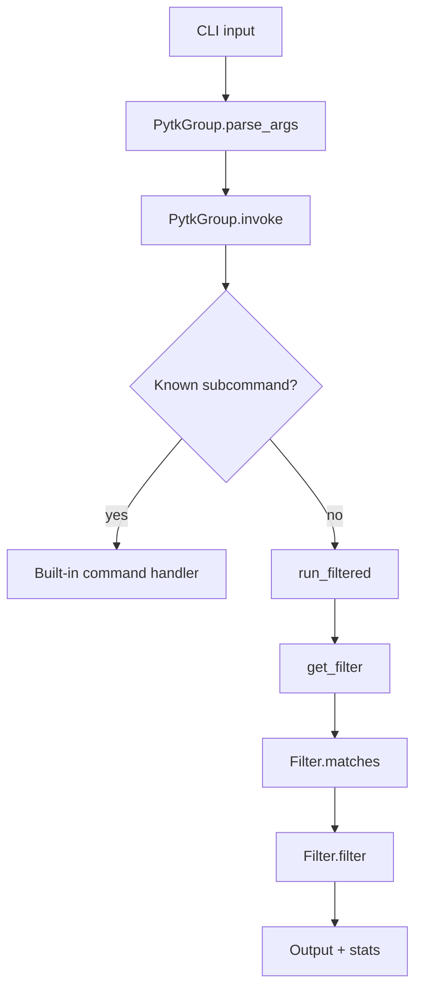

# CLI Reference

This page documents the `pytk` command-line interface in a reference style. It focuses on command shape, flags, arguments, defaults, and observable side effects, with special attention to the CLI dispatch path implemented by [`PytkGroup.parse_args`](src/pytk/cli.py#L128), [`PytkGroup.invoke`](src/pytk/cli.py#L149), and [`main`](src/pytk/cli.py#L185).

## Command Tree

The top-level entry point is the Click-based group defined in [`PytkGroup`](src/pytk/cli.py#L125), which supports both built-in subcommands and “fall-through” execution for unknown commands.

```text
pytk
├── gain
├── init
├── list-filters
├── passthrough
├── config
│   ├── show
│   ├── get
│   └── set
├── doctor
└── hook
    ├── enable
    ├── disable
    ├── status
    └── run-claude
```

In addition to explicit subcommands, `pytk` can proxy arbitrary commands and apply a matching filter before execution. That behavior is handled by the custom group class [`PytkGroup`](src/pytk/cli.py#L125) and the filtered execution path in [`run_filtered`](src/pytk/runner.py#L31).

> **Sources:** `src/pytk/cli.py` · L125–L200 · [`PytkGroup`](src/pytk/cli.py#L125) · [`main`](src/pytk/cli.py#L185)

## Dispatch and Passthrough Behavior

The CLI is intentionally dual-purpose:

1. It behaves like a normal Click application for built-in subcommands.
2. It falls through to command interception for unknown commands.

[`PytkGroup.parse_args`](src/pytk/cli.py#L128) captures the raw argument vector and preserves it for later dispatch. [`PytkGroup.invoke`](src/pytk/cli.py#L149) then decides whether the invocation is:
- a known built-in command,
- a passthrough command, or
- a command that should be executed through filter selection.

The `main` function accepts two global flags:
- `--dry-run`
- `--no-cache`

These are used by the execution layer rather than by individual filters. The docstring on [`main`](src/pytk/cli.py#L185) describes `pytk` as a proxy “that reduces LLM token consumption,” which matches the implementation pattern of running the underlying command, optionally filtering its output, then recording stats.

### Global Flags

| Flag | Type | Default | Applies To | Side Effects |
|------|------|---------|------------|--------------|
| `--dry-run` | boolean | `false` | All filtered executions | Prefixes output lines in dry-run mode; does not write stats |
| `--no-cache` | boolean | `false` | Filtered executions | Bypasses cache lookup and cache write paths |

The observable dry-run behavior is tested in `tests/test_dry_run.py`, but the command-layer entry point is still [`main`](src/pytk/cli.py#L185) and the runtime path is [`run_filtered`](src/pytk/runner.py#L31).

> **Sources:** `src/pytk/cli.py` · L185–L200 · [`main`](src/pytk/cli.py#L185) · `src/pytk/runner.py` · L31–L90 · [`run_filtered`](src/pytk/runner.py#L31)

## `gain`

[`gain`](src/pytk/cli.py#L207) reports token savings statistics derived from `~/.pytk/stats.json`. It is a reporting command only; it does not execute a target command.

### Signature and Arguments

| Item | Value |
|------|-------|
| Function | [`gain(fmt, since, reset)`](src/pytk/cli.py#L207) |
| Positional arguments | None |
| Options | `--fmt`, `--since`, `--reset` |
| Default format | table-like human output |
| Default time window | all available stats |
| Reset behavior | clears or truncates stored statistics according to implementation |

### Flags

| Flag | Type | Default | Purpose | Side Effects |
|------|------|---------|---------|--------------|
| `--fmt` | enum/string | default table | Select output format | Changes presentation only |
| `--since` | string | none | Restrict stats to a time cutoff | Filters records before aggregation |
| `--reset` | boolean | `false` | Reset stats after reading | May clear stats storage |

### Output Formats

The implementation exposes multiple formatters in [`_format_json`](src/pytk/cli.py#L92), [`_format_csv`](src/pytk/cli.py#L102), and [`_format_markdown`](src/pytk/cli.py#L112). These formatters operate on the rows and totals produced by [`_compute_rows_totals`](src/pytk/cli.py#L57), optionally after date filtering via [`_parse_since`](src/pytk/cli.py#L20) and [`_filter_stats_by_since`](src/pytk/cli.py#L36).

| Format | Formatter | Notes |
|--------|-----------|------|
| JSON | [`_format_json`](src/pytk/cli.py#L92) | Structured output with period metadata |
| CSV | [`_format_csv`](src/pytk/cli.py#L102) | Flat export for spreadsheets |
| Markdown | [`_format_markdown`](src/pytk/cli.py#L112) | Human-readable summary table |
| Default | internal table rendering | Used when `--fmt` is omitted |

### Side Effects

- Reads stats from the local stats store.
- Optionally filters by date cutoff.
- Optionally resets stats when requested.
- Emits formatted savings data to stdout.

> **Sources:** `src/pytk/cli.py` · L20–L122, L207–L275 · [`gain`](src/pytk/cli.py#L207) · [`_parse_since`](src/pytk/cli.py#L20) · [`_compute_rows_totals`](src/pytk/cli.py#L57)

## `config`

The config command family manages merged configuration state and project-local configuration edits. The top-level command is [`config`](src/pytk/cli.py#L605), which groups the `show`, `get`, and `set` subcommands.

### Command Tree

```text
pytk config
├── show
├── get <key>
└── set <key> <value>
```

### Configuration Model

Configuration is loaded and merged by [`load_config`](src/pytk/config.py#L47), which combines defaults, user config, and project config. The helper [`get_filter_config`](src/pytk/config.py#L66) extracts per-filter settings. This section is intentionally limited to command behavior; it does not document individual filter internals.

| Source | Role |
|--------|------|
| Default config | Baseline values |
| User config | Global overrides |
| Project config | Repo-local overrides from `.pytk.toml` |

### `config show`

[`config_show`](src/pytk/cli.py#L611) prints the effective merged configuration.

| Item | Value |
|------|-------|
| Arguments | none |
| Defaults | merged configuration from `load_config` |
| Side effects | read-only |
| Output | human-readable config dump |

### `config get`

[`config_get`](src/pytk/cli.py#L622) retrieves a single value by dotted key, such as `filters.cat.max_lines`.

| Item | Value |
|------|-------|
| Arguments | `key` |
| Defaults | none |
| Key format | dotted path |
| Side effects | read-only |
| Output | a single scalar or structured value |

### `config set`

[`config_set`](src/pytk/cli.py#L639) writes a value into project configuration.

| Item | Value |
|------|-------|
| Arguments | `key`, `value` |
| Defaults | none |
| Target file | `.pytk.toml` in the project directory |
| Side effects | creates or updates project config file |
| Safety | only affects the project-local config layer |

### Notes on Selection Behavior

The config commands do not invoke filters directly. They influence filter behavior indirectly by changing values read by the runtime via [`load_config`](src/pytk/config.py#L47) and [`get_filter_config`](src/pytk/config.py#L66).

> **Sources:** `src/pytk/cli.py` · L605–L667 · [`config`](src/pytk/cli.py#L605) · [`config_show`](src/pytk/cli.py#L611) · [`config_get`](src/pytk/cli.py#L622) · [`config_set`](src/pytk/cli.py#L639) · `src/pytk/config.py` · L28–L68

## `doctor`

[`doctor_cmd`](src/pytk/cli.py#L671) runs an environment health check and prints a report.

### Command Shape

| Item | Value |
|------|-------|
| Function | [`doctor_cmd()`](src/pytk/cli.py#L671) |
| Arguments | none |
| Defaults | no user input required |
| Side effects | read-only diagnostics |
| Exit behavior | returns nonzero on critical failure via doctor runner |

The implementation delegates to [`run_doctor`](src/pytk/doctor.py#L28), which returns an exit code and emits diagnostic messages through internal helpers like [`_ok`](src/pytk/doctor.py#L16), [`_warn`](src/pytk/doctor.py#L24), and [`_fail`](src/pytk/doctor.py#L20).

### What It Checks

The analysis data shows the doctor command validates:
- installation and runtime environment,
- version/reporting output,
- filter availability,
- Claude hook presence when applicable.

### Side Effects

- No mutation of config or stats.
- May inspect files, shell config, and installed hook artifacts.
- Prints a structured health report.

> **Sources:** `src/pytk/cli.py` · L671–L676 · [`doctor_cmd`](src/pytk/cli.py#L671) · `src/pytk/doctor.py` · L16–L112 · [`run_doctor`](src/pytk/doctor.py#L28)

## `hook`

The hook command family manages shell integration for automatic command interception.

### Command Tree

```text
pytk hook
├── enable <shell>
├── disable <shell>
├── status <shell>
└── run-claude
```

### `hook enable`

[`hook_enable`](src/pytk/cli.py#L713) enables a shell hook so commands can be auto-intercepted without typing the `pytk` prefix.

| Item | Value |
|------|-------|
| Arguments | `shell` |
| Defaults | none |
| Supported shells | shell-specific; resolved by hook builder |
| Side effects | modifies shell config |
| Persistence | writes hook lines/snippets to the relevant shell config file |

The lower-level hook writer lives in [`enable_hook`](src/pytk/hook.py#L90), which returns whether the hook already existed and the config path it touched.

### `hook disable`

[`hook_disable`](src/pytk/cli.py#L726) removes the shell hook section.

| Item | Value |
|------|-------|
| Arguments | `shell` |
| Defaults | none |
| Side effects | removes previously inserted hook block |
| Safety | preserves surrounding file contents |

### `hook status`

[`hook_status_cmd`](src/pytk/cli.py#L739) reports whether the hook is active.

| Item | Value |
|------|-------|
| Arguments | `shell` |
| Defaults | none |
| Side effects | read-only |
| Output | active/inactive status string |

### `hook run-claude`

[`hook_run_claude`](src/pytk/cli.py#L750) is an internal command used by the Claude Code PreToolUse hook.

| Item | Value |
|------|-------|
| Arguments | none |
| Intended caller | Claude hook script |
| Side effects | reads stdin, may rewrite a command |
| Public use | internal integration only |

The underlying hook logic is implemented in [`pytk.hooks.claude_hook.main`](src/pytk/hooks/claude_hook.py#L43), with command rewrite decisions in [`should_rewrite`](src/pytk/hooks/claude_hook.py#L25) and [`rewrite_command`](src/pytk/hooks/claude_hook.py#L38).

### Shell Integration Notes

The shell config helpers in [`src/pytk/hook.py`](src/pytk/hook.py) show that the hook system is file-based rather than daemon-based. That means enabling/disabling is a configuration edit, not a background service lifecycle operation.

> **Sources:** `src/pytk/cli.py` · L706–L753 · [`hook`](src/pytk/cli.py#L706) · [`hook_enable`](src/pytk/cli.py#L713) · [`hook_disable`](src/pytk/cli.py#L726) · [`hook_status_cmd`](src/pytk/cli.py#L739) · [`hook_run_claude`](src/pytk/cli.py#L750) · `src/pytk/hook.py` · L43–L136 · `src/pytk/hooks/claude_hook.py` · L25–L65

## `init`

[`init_cmd`](src/pytk/cli.py#L538) prints integration instructions for AI coding agents and can also install agent-specific files.

### Supported Agents

The analysis data shows dedicated installation helpers for:
- Windsurf via [`_install_windsurf`](src/pytk/cli.py#L323)
- Gemini CLI via [`_install_gemini_hook`](src/pytk/cli.py#L376)
- Claude Code via [`_install_claude_hook`](src/pytk/cli.py#L427)
- Cursor via [`_install_cursor_rules`](src/pytk/cli.py#L519)

### Command Shape

| Item | Value |
|------|-------|
| Function | [`init_cmd(agent)`](src/pytk/cli.py#L538) |
| Arguments | `agent` |
| Defaults | agent-specific instruction output |
| Side effects | may create or update agent configuration files |
| Output | installation or usage instructions |

### Behavior by Agent

| Agent | Observable behavior | Side effects |
|-------|----------------------|--------------|
| Claude | installs hook/config artifacts via `_install_claude_hook` | may create hook files and merge settings |
| Gemini | installs BeforeTool hook files | may create or update JSON/settings files |
| Windsurf | appends pytk section to `.windsurfrules` | may create file if missing |
| Cursor | installs rules file in project directory | may create `.cursor`-style rules artifacts |

The tests indicate these install paths are idempotent and preserve existing config when the section already exists.

> **Sources:** `src/pytk/cli.py` · L323–L591 · [`_install_windsurf`](src/pytk/cli.py#L323) · [`_install_gemini_hook`](src/pytk/cli.py#L376) · [`_install_claude_hook`](src/pytk/cli.py#L427) · [`_install_cursor_rules`](src/pytk/cli.py#L519) · [`init_cmd`](src/pytk/cli.py#L538)

## `passthrough`

[`passthrough`](src/pytk/cli.py#L596) is the explicit escape hatch for running a command without any filtering.

### Command Shape

| Item | Value |
|------|-------|
| Function | [`passthrough(command)`](src/pytk/cli.py#L596) |
| Arguments | `command` |
| Defaults | none |
| Side effects | executes command directly |
| Filtering | none |
| Caching | not used |

### Behavior Summary

- The command is passed through unchanged.
- No filter selection occurs.
- No stats record is appended.
- Useful when the user wants to bypass `pytk` rewriting entirely.

This path is distinct from the implicit passthrough used by `PytkGroup` for unknown commands, because it is a named user-facing subcommand.

> **Sources:** `src/pytk/cli.py` · L596–L601 · [`passthrough`](src/pytk/cli.py#L596)

## Unknown Command Selection and Filter Invocation

When a command is not one of the explicit built-ins, [`PytkGroup.invoke`](src/pytk/cli.py#L149) routes it into the filtered execution path. The CLI does not document filter internals here; it only selects a filter and invokes it.

### High-Level Flow



### Selection Rules

- The command is normalized into an argument list by the Click group.
- [`get_filter`](src/pytk/filters/registry.py#L22) selects a filter implementation.
- The selected filter’s [`matches`](src/pytk/filters/base.py#L26) and [`filter`](src/pytk/filters/base.py#L30) methods determine how command output is reduced.
- If no filter matches, execution falls back to unfiltered behavior.

### What This Means for Users

Users can either:
- run a built-in command such as `pytk gain`, `pytk config get`, or `pytk hook enable`, or
- type an ordinary command under `pytk` and let the CLI decide whether to filter it.

> **Sources:** `src/pytk/cli.py` · L125–L200 · [`PytkGroup`](src/pytk/cli.py#L125) · [`PytkGroup.parse_args`](src/pytk/cli.py#L128) · [`PytkGroup.invoke`](src/pytk/cli.py#L149) · `src/pytk/filters/registry.py` · L22–L26 · [`get_filter`](src/pytk/filters/registry.py#L22)

## Reference Table of CLI Commands

| Command | Arguments | Defaults | Primary Side Effects |
|--------|-----------|----------|----------------------|
| `gain` | none | default table output | reads stats, optionally filters by time, optionally resets stats |
| `config show` | none | merged config | prints config |
| `config get` | `key` | none | reads one config value |
| `config set` | `key`, `value` | none | writes `.pytk.toml` |
| `doctor` | none | none | prints environment report |
| `hook enable` | `shell` | none | writes shell hook config |
| `hook disable` | `shell` | none | removes shell hook config |
| `hook status` | `shell` | none | prints hook status |
| `hook run-claude` | none | none | processes Claude hook input |
| `init` | `agent` | agent-specific | creates or updates agent integration files |
| `passthrough` | `command` | none | executes command without filtering |

> **Sources:** `src/pytk/cli.py` · L185–L753 · [`main`](src/pytk/cli.py#L185) · [`gain`](src/pytk/cli.py#L207) · [`config_get`](src/pytk/cli.py#L622) · [`config_set`](src/pytk/cli.py#L639) · [`doctor_cmd`](src/pytk/cli.py#L671) · [`hook_enable`](src/pytk/cli.py#L713) · [`hook_run_claude`](src/pytk/cli.py#L750) · [`init_cmd`](src/pytk/cli.py#L538) · [`passthrough`](src/pytk/cli.py#L596)