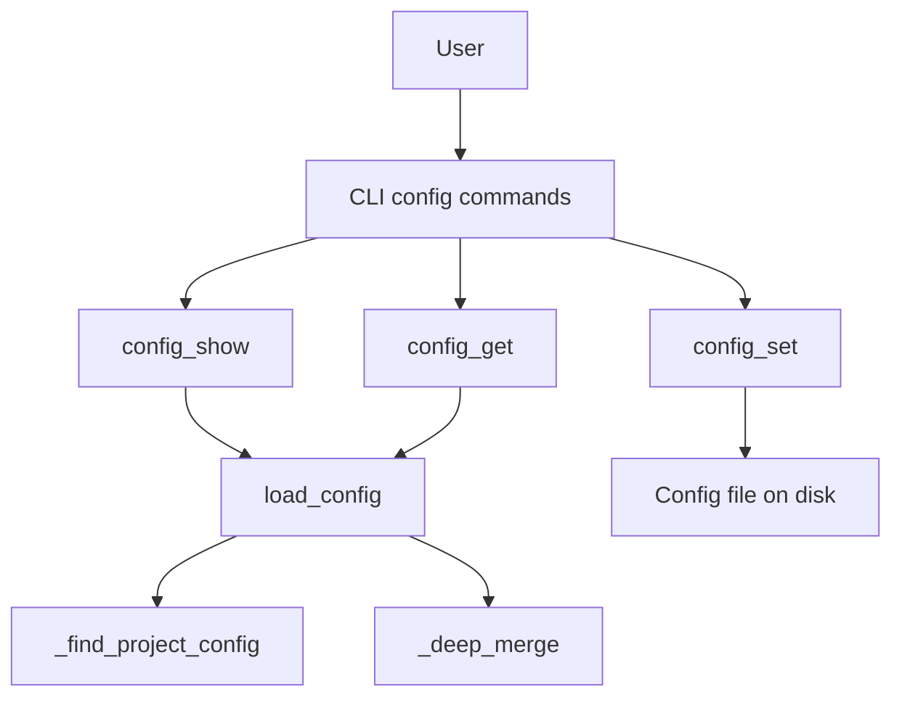
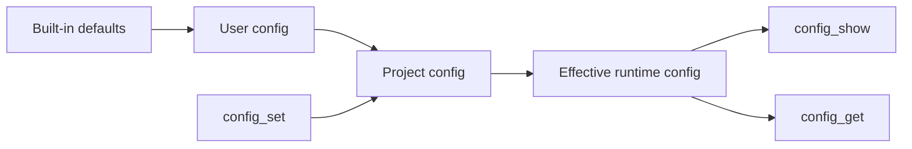

# CLI Configuration Model

This page explains the user-facing configuration model for the `pytk` CLI: where configuration is loaded from, how users inspect and edit it, what defaults apply, and which configuration keys matter at runtime. The scope here is deliberately limited to runtime configuration exposed through the CLI and the config loader; it excludes hook implementation details and internal helper mechanics.

## Overview

The CLI’s configuration surface is centered around [`load_config`](src/pytk/config.py#L47), which merges built-in defaults with optional user-level and project-level files, and around the user-facing config commands exposed in [`config_show`](src/pytk/cli.py#L611), [`config_get`](src/pytk/cli.py#L622), and [`config_set`](src/pytk/cli.py#L639). The configuration subsystem is small but practical: it is designed to let users view the effective config, inspect individual keys, and persist changes without editing files manually.

At a high level, the flow is:

1. Determine whether a project-local config file exists via [`_find_project_config`](src/pytk/config.py#L28).
2. Load user and project config data with deep merging via [`_deep_merge`](src/pytk/config.py#L37).
3. Expose the resulting structure to CLI commands such as [`config_show`](src/pytk/cli.py#L611) and [`config_get`](src/pytk/cli.py#L622).



> **Sources:** `src/pytk/config.py` · L28–L68 · [`load_config`](src/pytk/config.py#L47), [`_find_project_config`](src/pytk/config.py#L28), [`_deep_merge`](src/pytk/config.py#L37) · `src/pytk/cli.py` · L611–L667 · [`config_show`](src/pytk/cli.py#L611), [`config_get`](src/pytk/cli.py#L622), [`config_set`](src/pytk/cli.py#L639)

## Config File Locations

The observable behavior from the config loader is that `pytk` supports more than one configuration scope:

- a **user config file**
- a **project config file**, discovered by walking the current directory’s parents via [`_find_project_config`](src/pytk/config.py#L28)

The exact filenames are not surfaced in the extracted symbol index, so this documentation avoids guessing those names. What is clear from the tests and loader behavior is the precedence model:

1. built-in defaults
2. user config
3. project config

Project-level settings override user-level settings, and user-level settings override defaults. This is validated by the tests [`test_user_config_overrides_defaults`](tests/test_config.py#L31) and [`test_project_overrides_user`](tests/test_config.py#L41).

The project config lookup is directory-aware: [`_find_project_config`](src/pytk/config.py#L28) searches upward through parent directories until it finds a matching file, which is verified by [`test_find_project_config_walks_parents`](tests/test_config.py#L52).

| Scope | Purpose | Precedence |
|---|---|---:|
| Built-in defaults | Baseline runtime behavior when no files exist | Lowest |
| User config | Personal preferences for all projects | Middle |
| Project config | Repository-specific settings for the current workspace | Highest |

> **Sources:** `src/pytk/config.py` · L28–L35 · [`_find_project_config`](src/pytk/config.py#L28) · `tests/test_config.py` · L31–L57 · [`test_user_config_overrides_defaults`](tests/test_config.py#L31), [`test_project_overrides_user`](tests/test_config.py#L41), [`test_find_project_config_walks_parents`](tests/test_config.py#L52)

## Configuration Commands

The CLI exposes three user-facing commands for working with config:

### `config_show`

[`config_show`](src/pytk/cli.py#L611) prints the effective configuration after merging defaults and any loaded files. This is the best way to understand what the CLI will actually use at runtime.

### `config_get`

[`config_get`](src/pytk/cli.py#L622) retrieves a single configuration value by key. This is useful for checking the resolved value of a specific setting without dumping the whole structure.

### `config_set`

[`config_set`](src/pytk/cli.py#L639) persists a configuration value. The tests show that it can create a config file if one does not exist, which makes it suitable for first-time setup as well as edits to existing configuration; see [`test_config_set_creates_file`](tests/test_config.py#L100).

A typical workflow looks like this:

```bash
pytk config show
pytk config get <key>
pytk config set <key> <value>
```

The implementation details of writing files are not the focus here; the important point for users is that these commands let them inspect and manage the same runtime config structure that the CLI consumes.

> **Sources:** `src/pytk/cli.py` · L611–L667 · [`config_show`](src/pytk/cli.py#L611), [`config_get`](src/pytk/cli.py#L622), [`config_set`](src/pytk/cli.py#L639) · `tests/test_config.py` · L80–L110 · [`test_config_show`](tests/test_config.py#L80), [`test_config_get`](tests/test_config.py#L91), [`test_config_set_creates_file`](tests/test_config.py#L100)

## Default Values

When no configuration files are present, [`load_config`](src/pytk/config.py#L47) still returns a usable configuration object populated with defaults. This behavior is explicitly covered by [`test_defaults_returned_when_no_files`](tests/test_config.py#L7).

The analysis data does not expose the literal default values inline, so this page avoids inventing them. What is observable is the behavior:

- configuration always resolves to a complete structure
- missing files do not cause errors
- defaults serve as the base for all merges

This is important for first-run usability: users can run the CLI without creating any config files and still get predictable behavior.

| Behavior | Result |
|---|---|
| No config files found | Defaults are returned |
| User config exists | User values overlay defaults |
| Project config exists | Project values overlay user + defaults |
| Unknown top-level key requested | Returns empty config slice |

The last row corresponds to [`test_unknown_key_returns_empty`](tests/test_config.py#L68), which suggests that missing or unrecognized config namespaces are handled gracefully.

> **Sources:** `src/pytk/config.py` · L47–L68 · [`load_config`](src/pytk/config.py#L47), [`get_filter_config`](src/pytk/config.py#L66) · `tests/test_config.py` · L7–L11 · [`test_defaults_returned_when_no_files`](tests/test_config.py#L7)

## Common Options

The configuration model is centered around filter behavior. Although the repository contains many command-specific filters, the user-facing config surface appears to be organized around per-filter settings retrieved through [`get_filter_config`](src/pytk/config.py#L66).

Commonly relevant configuration areas include:

- enabling or tuning command-specific filtering behavior
- controlling how verbose output is compacted
- influencing per-tool handling for tools like Git, Docker, npm, pytest, kubectl, and others

The exact per-filter keys are not fully enumerated in the analysis payload, so the table below focuses on the observable, user-facing config namespaces and their purpose rather than inventing literals.

| Config key / namespace | Purpose | Source of truth |
|---|---|---|
| Top-level defaults | Baseline CLI behavior when no user/project file is present | [`load_config`](src/pytk/config.py#L47) |
| Project overrides | Repository-specific runtime settings | [`_find_project_config`](src/pytk/config.py#L28) + merge logic in [`_deep_merge`](src/pytk/config.py#L37) |
| User overrides | Personal defaults across repositories | [`load_config`](src/pytk/config.py#L47) |
| Filter-specific config | Per-command filtering behavior resolved by key | [`get_filter_config`](src/pytk/config.py#L66) |

This is intentionally conservative: the repo clearly supports filter-aware runtime config, but the analysis data does not expose a complete list of user-editable keys.

> **Sources:** `src/pytk/config.py` · L47–L68 · [`load_config`](src/pytk/config.py#L47), [`get_filter_config`](src/pytk/config.py#L66) · `tests/test_config.py` · L60–L72 · [`test_get_filter_config`](tests/test_config.py#L60), [`test_unknown_key_returns_empty`](tests/test_config.py#L68)

## Configuration Key Mapping

The table below maps the configuration concepts that are visible from the codebase to their purpose and where they originate. Because the symbol index does not expose the concrete default dictionary contents, this mapping is intentionally framed around the observable runtime model.

| Config key / area | Purpose | Source |
|---|---|---|
| Global config object | Holds the merged effective runtime configuration | [`load_config`](src/pytk/config.py#L47) |
| User-level file | Stores personal defaults | loader behavior in [`load_config`](src/pytk/config.py#L47) |
| Project-level file | Stores repository-specific overrides | [`_find_project_config`](src/pytk/config.py#L28) |
| Filter namespace lookup | Returns config for a specific filter or command family | [`get_filter_config`](src/pytk/config.py#L66) |
| Unknown/missing key | Produces an empty result rather than failing | [`test_unknown_key_returns_empty`](tests/test_config.py#L68) |

### Practical reading of the model

- Use [`config_show`](src/pytk/cli.py#L611) to see the merged result.
- Use [`config_get`](src/pytk/cli.py#L622) to inspect a specific key.
- Use [`config_set`](src/pytk/cli.py#L639) to persist a value.
- Expect project settings to take priority over user settings.
- Expect user settings to take priority over built-in defaults.

> **Sources:** `src/pytk/cli.py` · L611–L667 · [`config_show`](src/pytk/cli.py#L611), [`config_get`](src/pytk/cli.py#L622), [`config_set`](src/pytk/cli.py#L639) · `src/pytk/config.py` · L28–L68 · [`_find_project_config`](src/pytk/config.py#L28), [`load_config`](src/pytk/config.py#L47), [`get_filter_config`](src/pytk/config.py#L66)

## Mental Model for Users

If you are new to `pytk`, the configuration model is easiest to understand as layered overrides:



The result is a predictable workflow:

- **Before editing anything**, run [`config_show`](src/pytk/cli.py#L611).
- **To check one setting**, run [`config_get`](src/pytk/cli.py#L622).
- **To update a setting**, run [`config_set`](src/pytk/cli.py#L639).
- **To make repo-local changes**, prefer the project config file discovered by [`_find_project_config`](src/pytk/config.py#L28).

This arrangement keeps configuration discoverable for beginners while still allowing repository-level customization for teams.

> **Sources:** `src/pytk/cli.py` · L611–L667 · [`config_show`](src/pytk/cli.py#L611), [`config_get`](src/pytk/cli.py#L622), [`config_set`](src/pytk/cli.py#L639) · `src/pytk/config.py` · L28–L68 · [`_find_project_config`](src/pytk/config.py#L28), [`load_config`](src/pytk/config.py#L47)