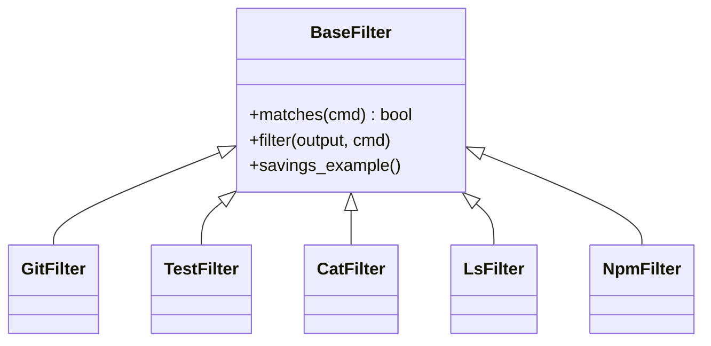

# Filter Framework and Built-in Filters

## Overview

The filter framework is centered on a single abstraction: [`BaseFilter`](src/pytk/filters/base.py#L24-L35). Every built-in filter subclasses this base class and implements the same three-part contract:

1. [`matches(self, cmd)`](src/pytk/filters/base.py#L26-L27) decides whether the filter should handle a command.
2. [`filter(self, output, cmd)`](src/pytk/filters/base.py#L30-L31) transforms the captured command output.
3. [`savings_example(self)`](src/pytk/filters/base.py#L33-L35) returns a small example payload used by the filter listing command to show before/after savings.

Two utility helpers in the same module support that contract: [`strip_ansi`](src/pytk/filters/base.py#L8-L10) removes escape sequences from terminal output, and [`cmd_name`](src/pytk/filters/base.py#L13-L21) normalizes `cmd[0]` to a basename so filters can match both bare commands and fully qualified paths.

Selection is handled by the registry entry point [`get_filter`](src/pytk/filters/registry.py#L22-L26). The registry imports the built-in filter modules in [`pytk.filters.__init__`](src/pytk/filters/__init__.py#L1-L1) and then walks them in order, returning the first filter whose [`matches`](src/pytk/filters/base.py#L26-L27) method accepts the command. This gives the system a simple, deterministic “first match wins” behavior while keeping the individual filters focused on command-specific compression logic.

A notable design choice is that built-in filters are not generic output compressors; they are command-family adapters. Each filter knows the output shape of a small set of related tools, strips noise, and preserves only the lines or fields most useful to the caller.

> **Sources:** `src/pytk/filters/base.py` · L8–L35 · [`BaseFilter`](src/pytk/filters/base.py#L24-L35) · [`strip_ansi`](src/pytk/filters/base.py#L8-L10) · [`cmd_name`](src/pytk/filters/base.py#L13-L21)  
> **Sources:** `src/pytk/filters/registry.py` · L22–L26 · [`get_filter`](src/pytk/filters/registry.py#L22-L26)  
> **Sources:** `src/pytk/filters/__init__.py` · L1–L1

## Built-in Filter Catalog

The project ships a small catalog of built-in filters, each implemented as a subclass of [`BaseFilter`](src/pytk/filters/base.py#L24-L35). The table below summarizes the command families each filter recognizes, the main transformation it performs, and whether it defines a [`savings_example`](src/pytk/filters/base.py#L33-L35) method.

| Filter class | Command families recognized | Primary transformation | Has `savings_example`? |
|---|---|---|---|
| [`LsFilter`](src/pytk/filters/ls.py#L7-L62) | `ls`, `find` | Removes permission/metadata noise and truncates long listings via `_truncate` | Yes |
| [`GitFilter`](src/pytk/filters/git.py#L5-L124) | `git` | Compresses status, diff, log, and selected action outputs; strips hints and decorations | Yes |
| [`TestFilter`](src/pytk/filters/test.py#L7-L118) | `pytest`, `python -m pytest`, `python3 -m pytest` and related test invocations | Keeps failures and summaries while eliding passing noise | Yes |
| [`GrepFilter`](src/pytk/filters/grep.py#L10-L74) | `grep`, `rg`, `ag`-style search commands as recognized in the implementation | Groups matching lines by file and collapses noisy output | Yes |
| [`CatFilter`](src/pytk/filters/cat.py#L9-L49) | `cat` | Truncates long files and removes blank-line noise while preserving head/tail context | Yes |
| [`DockerFilter`](src/pytk/filters/docker.py#L6-L207) | `docker`, `docker-compose` | Compresses `ps`, `images`, `logs`, `build`, compose actions, and `inspect` output | Yes |
| [`CargoFilter`](src/pytk/filters/cargo.py#L5-L145) | `cargo`, `rustc`, `rustfmt`-adjacent command families | Drops build/test progress and keeps errors, summaries, and final results | Yes |
| [`NpmFilter`](src/pytk/filters/npm.py#L5-L127) | `npm`, `yarn`, `pnpm`, `npx` | Strips install/run/audit/test prompts and progress noise; compresses package-manager output | Yes |
| [`CurlFilter`](src/pytk/filters/curl.py#L6-L142) | `curl`, `http`, `wget` | Removes verbose transport/progress noise and truncates JSON bodies where safe | Yes |
| [`KubectlFilter`](src/pytk/filters/kubectl.py#L6-L235) | `kubectl`, `k` alias | Reduces tabular and diagnostic output to the most relevant fields and warnings | Yes |
| [`MakeFilter`](src/pytk/filters/make.py#L5-L29) | `make` | Removes entering/leaving-directory chatter and build echo noise | Yes |
| [`TerraformFilter`](src/pytk/filters/terraform.py#L5-L37) | `terraform` | Strips refresh/apply noise while preserving warnings, errors, and completion lines | Yes |
| [`PackageManagerFilter`](src/pytk/filters/package_manager.py#L5-L45) | Generic package-manager command families recognized by the implementation | Compresses progress bars, download noise, and repetitive install logs | Yes |
| [`UvFilter`](src/pytk/filters/uv.py#L5-L52) | `uv` | Dispatches to package-manager or test-specific inner filters to reuse specialized compression logic | Yes |
| [`PoetryFilter`](src/pytk/filters/poetry.py#L5-L35) | `poetry` | Routes install output through package-manager-specific handling, with fallback behavior | Yes |
| [`LintFilter`](src/pytk/filters/lint.py#L5-L95) | `ruff`, `mypy`, `flake8`, `pylint`, `tsc` | Preserves diagnostics while removing clean-run noise and ANSI escape sequences | Yes |

A few entries deserve emphasis:

- [`UvFilter`](src/pytk/filters/uv.py#L5-L52) and [`PoetryFilter`](src/pytk/filters/poetry.py#L5-L35) are thin coordinators. Their job is less about direct text manipulation and more about forwarding to the more specific filters that already know how to condense install/test output.
- [`PackageManagerFilter`](src/pytk/filters/package_manager.py#L5-L45) is the broadest non-tool-specific filter in the catalog. It exists to cover shared package-manager noise patterns that show up across tools.
- [`LintFilter`](src/pytk/filters/lint.py#L5-L95) is the clearest example of diagnostic preservation: it does not try to “fix” the linter output, only make it smaller by stripping ANSI and retaining the actionable lines.

> **Sources:** `src/pytk/filters/ls.py` · L7–L62 · [`LsFilter`](src/pytk/filters/ls.py#L7-L62) · [`LsFilter.savings_example`](src/pytk/filters/ls.py#L57-L62)  
> **Sources:** `src/pytk/filters/git.py` · L5–L124 · [`GitFilter`](src/pytk/filters/git.py#L5-L124) · [`GitFilter.savings_example`](src/pytk/filters/git.py#L119-L124)  
> **Sources:** `src/pytk/filters/test.py` · L7–L118 · [`TestFilter`](src/pytk/filters/test.py#L7-L118) · [`TestFilter.savings_example`](src/pytk/filters/test.py#L113-L118)  
> **Sources:** `src/pytk/filters/grep.py` · L10–L74 · [`GrepFilter`](src/pytk/filters/grep.py#L10-L74) · [`GrepFilter.savings_example`](src/pytk/filters/grep.py#L69-L74)  
> **Sources:** `src/pytk/filters/cat.py` · L9–L49 · [`CatFilter`](src/pytk/filters/cat.py#L9-L49) · [`CatFilter.savings_example`](src/pytk/filters/cat.py#L44-L49)  
> **Sources:** `src/pytk/filters/docker.py` · L6–L207 · [`DockerFilter`](src/pytk/filters/docker.py#L6-L207) · [`DockerFilter.savings_example`](src/pytk/filters/docker.py#L202-L207)  
> **Sources:** `src/pytk/filters/cargo.py` · L5–L145 · [`CargoFilter`](src/pytk/filters/cargo.py#L5-L145) · [`CargoFilter.savings_example`](src/pytk/filters/cargo.py#L140-L145)  
> **Sources:** `src/pytk/filters/npm.py` · L5–L127 · [`NpmFilter`](src/pytk/filters/npm.py#L5-L127) · [`NpmFilter.savings_example`](src/pytk/filters/npm.py#L122-L127)  
> **Sources:** `src/pytk/filters/curl.py` · L6–L142 · [`CurlFilter`](src/pytk/filters/curl.py#L6-L142) · [`CurlFilter.savings_example`](src/pytk/filters/curl.py#L137-L142)  
> **Sources:** `src/pytk/filters/kubectl.py` · L6–L235 · [`KubectlFilter`](src/pytk/filters/kubectl.py#L6-L235) · [`KubectlFilter.savings_example`](src/pytk/filters/kubectl.py#L230-L235)  
> **Sources:** `src/pytk/filters/make.py` · L5–L29 · [`MakeFilter`](src/pytk/filters/make.py#L5-L29) · [`MakeFilter.savings_example`](src/pytk/filters/make.py#L24-L29)  
> **Sources:** `src/pytk/filters/terraform.py` · L5–L37 · [`TerraformFilter`](src/pytk/filters/terraform.py#L5-L37) · [`TerraformFilter.savings_example`](src/pytk/filters/terraform.py#L32-L37)  
> **Sources:** `src/pytk/filters/package_manager.py` · L5–L45 · [`PackageManagerFilter`](src/pytk/filters/package_manager.py#L5-L45) · [`PackageManagerFilter.savings_example`](src/pytk/filters/package_manager.py#L40-L45)  
> **Sources:** `src/pytk/filters/uv.py` · L5–L52 · [`UvFilter`](src/pytk/filters/uv.py#L5-L52) · [`UvFilter.savings_example`](src/pytk/filters/uv.py#L47-L52)  
> **Sources:** `src/pytk/filters/poetry.py` · L5–L35 · [`PoetryFilter`](src/pytk/filters/poetry.py#L5-L35) · [`PoetryFilter.savings_example`](src/pytk/filters/poetry.py#L34-L35)  
> **Sources:** `src/pytk/filters/lint.py` · L5–L95 · [`LintFilter`](src/pytk/filters/lint.py#L5-L95) · [`LintFilter.savings_example`](src/pytk/filters/lint.py#L90-L95)

## Selection and Dispatch Behavior

Filter selection is intentionally lightweight. The registry module [`pytk.filters.registry`](src/pytk/filters/registry.py#L1-L26) is responsible for importing all available filter modules and choosing the first match through [`get_filter`](src/pytk/filters/registry.py#L22-L26). That means the order of registered filters matters when multiple filters could plausibly accept a command.

The shared matching strategy is based on command normalization via [`cmd_name`](src/pytk/filters/base.py#L13-L21). This allows a filter to recognize commands even when invoked through a full path, such as a virtualenv binary or system path. The base class then gives each concrete filter freedom to decide whether it should match on only the command name, on arguments as well, or on both.

A practical consequence of this design is that the framework supports both direct tool filters and wrapper filters. For example, [`UvFilter`](src/pytk/filters/uv.py#L5-L52) can hand off to other filters, while [`PoetryFilter`](src/pytk/filters/poetry.py#L5-L35) can delegate install handling to more generic package-manager logic.

Because this page is focused on the filter family itself, it intentionally does not cover CLI invocation, execution flow, or hook integration.

> **Sources:** `src/pytk/filters/registry.py` · L1–L26 · [`get_filter`](src/pytk/filters/registry.py#L22-L26)  
> **Sources:** `src/pytk/filters/base.py` · L13–L35 · [`cmd_name`](src/pytk/filters/base.py#L13-L21) · [`BaseFilter`](src/pytk/filters/base.py#L24-L35)  
> **Sources:** `src/pytk/filters/poetry.py` · L5–L35 · [`PoetryFilter`](src/pytk/filters/poetry.py#L5-L35)  
> **Sources:** `src/pytk/filters/uv.py` · L5–L52 · [`UvFilter`](src/pytk/filters/uv.py#L5-L52)

## Common Transformation Patterns

Although each filter targets a specific command family, the implementation techniques repeat across the catalog:

### Noise stripping
Many filters remove non-semantic output such as ANSI escapes, progress bars, hints, or directory-change messages. The shared [`strip_ansi`](src/pytk/filters/base.py#L8-L10) helper appears throughout the implementations.

### Summarization
Tools like [`GitFilter`](src/pytk/filters/git.py#L5-L124), [`CargoFilter`](src/pytk/filters/cargo.py#L5-L145), and [`LintFilter`](src/pytk/filters/lint.py#L5-L95) preserve errors, warnings, or final result lines while discarding repetitive build chatter.

### Truncation
Filters such as [`CatFilter`](src/pytk/filters/cat.py#L9-L49), [`LsFilter`](src/pytk/filters/ls.py#L7-L62), and [`CurlFilter`](src/pytk/filters/curl.py#L6-L142) explicitly truncate verbose output when enough context remains to be useful.

### Delegation
Wrapper filters like [`PoetryFilter`](src/pytk/filters/poetry.py#L5-L35) and [`UvFilter`](src/pytk/filters/uv.py#L5-L52) reduce duplication by forwarding to more specialized filters.

> **Sources:** `src/pytk/filters/base.py` · L8–L10 · [`strip_ansi`](src/pytk/filters/base.py#L8-L10)  
> **Sources:** `src/pytk/filters/git.py` · L5–L124 · [`GitFilter`](src/pytk/filters/git.py#L5-L124)  
> **Sources:** `src/pytk/filters/cargo.py` · L5–L145 · [`CargoFilter`](src/pytk/filters/cargo.py#L5-L145)  
> **Sources:** `src/pytk/filters/lint.py` · L5–L95 · [`LintFilter`](src/pytk/filters/lint.py#L5-L95)  
> **Sources:** `src/pytk/filters/cat.py` · L9–L49 · [`CatFilter`](src/pytk/filters/cat.py#L9-L49)  
> **Sources:** `src/pytk/filters/ls.py` · L7–L62 · [`LsFilter`](src/pytk/filters/ls.py#L7-L62)  
> **Sources:** `src/pytk/filters/curl.py` · L6–L142 · [`CurlFilter`](src/pytk/filters/curl.py#L6-L142)  
> **Sources:** `src/pytk/filters/poetry.py` · L5–L35 · [`PoetryFilter`](src/pytk/filters/poetry.py#L5-L35)  
> **Sources:** `src/pytk/filters/uv.py` · L5–L52 · [`UvFilter`](src/pytk/filters/uv.py#L5-L52)