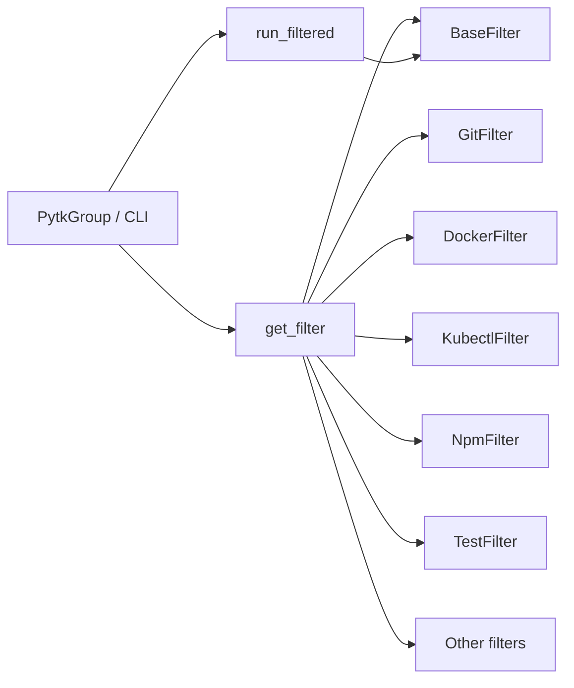

# pytk Developer Landing Page

## What it is

[`pytk`](src/pytk/__init__.py) is a Python CLI tool for compressing or filtering command output so developers can focus on the meaningful part of noisy terminal logs. The repository is organized around a command dispatcher in [`pytk.cli`](src/pytk/cli.py) that routes commands to specialized filter classes under [`src/pytk/filters/`](src/pytk/filters/base.py) and a runtime path in [`pytk.runner`](src/pytk/runner.py) that executes commands and applies the chosen filter. The project also includes shell hook support, config management, a benchmark script, and a VS Code extension for editor-side integration.

## Key Features

### CLI entry points

The main CLI surface lives in [`PytkGroup`](src/pytk/cli.py#L125) with dispatch handled through [`PytkGroup.parse_args`](src/pytk/cli.py#L128) and [`PytkGroup.invoke`](src/pytk/cli.py#L149). The CLI exposes commands such as [`gain`](src/pytk/cli.py#L207), [`init_cmd`](src/pytk/cli.py#L538), [`config`](src/pytk/cli.py#L605), [`doctor_cmd`](src/pytk/cli.py#L671), [`list_filters`](src/pytk/cli.py#L680), and hook-related commands like [`hook_enable`](src/pytk/cli.py#L713), [`hook_disable`](src/pytk/cli.py#L726), and [`hook_status_cmd`](src/pytk/cli.py#L739).

### Output filters

Filtering is implemented by a registry and a set of filter classes, starting with the base abstraction [`BaseFilter`](src/pytk/filters/base.py#L24) and the dispatcher [`get_filter`](src/pytk/filters/registry.py#L22). Specific filters include [`GitFilter`](src/pytk/filters/git.py#L5), [`DockerFilter`](src/pytk/filters/docker.py#L6), [`KubectlFilter`](src/pytk/filters/kubectl.py#L6), [`NpmFilter`](src/pytk/filters/npm.py#L5), [`TestFilter`](src/pytk/filters/test.py#L7), [`LsFilter`](src/pytk/filters/ls.py#L7), [`CatFilter`](src/pytk/filters/cat.py#L9), [`CurlFilter`](src/pytk/filters/curl.py#L6), [`LintFilter`](src/pytk/filters/lint.py#L5), [`MakeFilter`](src/pytk/filters/make.py#L5), [`PoetryFilter`](src/pytk/filters/poetry.py#L5), [`TerraformFilter`](src/pytk/filters/terraform.py#L5), [`UvFilter`](src/pytk/filters/uv.py#L5), and [`PackageManagerFilter`](src/pytk/filters/package_manager.py#L5).

### Hook installation commands

Hook installation and status management are handled through [`enable_hook`](src/pytk/hook.py#L90), [`disable_hook`](src/pytk/hook.py#L109), and [`hook_status`](src/pytk/hook.py#L128). The CLI wrappers [`hook_enable`](src/pytk/cli.py#L713), [`hook_disable`](src/pytk/cli.py#L726), and [`hook_status_cmd`](src/pytk/cli.py#L739) expose these actions to users. There is also Claude-specific hook rewriting logic in [`src/pytk/hooks/claude_hook.py`](src/pytk/hooks/claude_hook.py) via [`should_rewrite`](src/pytk/hooks/claude_hook.py#L25) and [`rewrite_command`](src/pytk/hooks/claude_hook.py#L38).

### Config management

Configuration is loaded and merged in [`load_config`](src/pytk/config.py#L47), with project discovery handled by [`_find_project_config`](src/pytk/config.py#L28) and merging by [`_deep_merge`](src/pytk/config.py#L37). The CLI exposes [`config_show`](src/pytk/cli.py#L611), [`config_get`](src/pytk/cli.py#L622), and [`config_set`](src/pytk/cli.py#L639) for inspecting and updating settings, while [`get_filter_config`](src/pytk/config.py#L66) provides per-filter configuration lookup.

### Benchmark script

Repository performance exploration lives in [`scripts/benchmark.py`](scripts/benchmark.py), which defines [`count_tokens`](scripts/benchmark.py#L26), [`run_cmd`](scripts/benchmark.py#L30), and [`benchmark`](scripts/benchmark.py#L58). This script is useful for estimating output reduction and comparing filtered vs. unfiltered command runs.

> **Sources:** `src/pytk/__init__.py` · `src/pytk/cli.py` · `src/pytk/runner.py` · `src/pytk/hook.py` · `src/pytk/config.py` · `scripts/benchmark.py` · `src/pytk/filters/base.py`

## Quick Start

### Install and build

The repository’s build commands are straightforward and use standard Python packaging tooling:

```bash
pip install build twine
python -m build
```

If you are working from a local checkout, install the project in editable mode first so the CLI entry points are available during development:

```bash
pip install -e .
```

### First run

The main user-facing flow is to invoke the CLI, then select a command or helper action through [`PytkGroup`](src/pytk/cli.py#L125). Typical first-run commands include:

```bash
pytk --help
pytk list-filters
pytk doctor
pytk config show
```

For command compression/filtering, the central workflow is:

```bash
pytk gain --help
pytk gain <your-command> [args...]
```

For shell integration, you can enable hooks through the CLI:

```bash
pytk hook enable
pytk hook status
pytk hook disable
```

And for agent/editor bootstrap flows, the repository also exposes initialization commands through [`init_cmd`](src/pytk/cli.py#L538), plus the Claude hook entry point in [`src/pytk/hooks/claude_hook.py`](src/pytk/hooks/claude_hook.py#L43).

> **Sources:** `src/pytk/cli.py` · `src/pytk/hooks/claude_hook.py` · `scripts/benchmark.py`

## Repository Map

| Path | Purpose | Notable Files |
|------|---------|---------------|
| `src/` | Core Python package and CLI/runtime logic | `src/pytk/cli.py`, `src/pytk/runner.py`, `src/pytk/config.py`, `src/pytk/hook.py`, `src/pytk/filters/*.py` |
| `tests/` | Automated test suite for CLI, config, hooks, and filters | `tests/test_cli.py`, `tests/test_config.py`, `tests/test_runner.py`, `tests/test_hook.py` |
| `scripts/` | Utility scripts for local development and analysis | `scripts/benchmark.py` |
| `vscode-extension/` | VS Code extension integration and UI support | `vscode-extension/src/extension.ts`, `vscode-extension/src/filterEngine.ts`, `vscode-extension/src/statsProvider.ts` |

The `src/` tree is the core of the tool, with the CLI dispatcher in [`pytk.cli`](src/pytk/cli.py) and the filter implementations in [`src/pytk/filters/`](src/pytk/filters/__init__.py). The `vscode-extension/` directory is separate from the Python package but mirrors the project’s goal of making command output more manageable in developer workflows.

> **Sources:** `src/pytk/cli.py` · `src/pytk/filters/__init__.py` · `scripts/benchmark.py` · `vscode-extension/src/extension.ts` · `vscode-extension/src/filterEngine.ts` · `vscode-extension/src/statsProvider.ts`

## Architecture at a Glance

For a deeper structural view, see the [architecture overview](architecture-overview). In short, the main flow is: CLI dispatch in [`PytkGroup.invoke`](src/pytk/cli.py#L149) resolves a command, [`get_filter`](src/pytk/filters/registry.py#L22) selects the appropriate filter class, and [`run_filtered`](src/pytk/runner.py#L31) executes the underlying command and post-processes its output. The architecture is intentionally layered: command parsing and user-facing helpers live in `src/pytk/cli.py`, reusable filtering behavior lives in `src/pytk/filters/`, and execution orchestration lives in `src/pytk/runner.py`.



> **Sources:** `src/pytk/cli.py` · `src/pytk/runner.py` · `src/pytk/filters/registry.py` · `src/pytk/filters/base.py` · [architecture overview](architecture-overview)

## Notes for Developers

This landing page intentionally stays high-level. The implementation details of individual filters, test coverage, and command-specific output transformations are documented elsewhere. If you are coming to the project for the first time, the best sequence is:

1. Read the CLI help via `pytk --help`.
2. Inspect available filters with `pytk list-filters`.
3. Review config state with `pytk config show`.
4. Enable hooks only after verifying with `pytk doctor` and `pytk hook status`.

> **Sources:** `src/pytk/cli.py` · `src/pytk/doctor.py` · `src/pytk/hook.py`