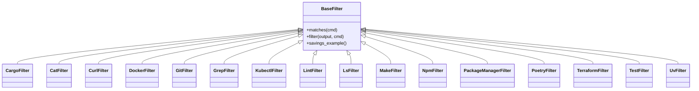

# Shared Filter Abstraction

## Overview

The shared filtering layer in `pytk` is built around [`BaseFilter`](src/pytk/filters/base.py#L24), an abstract contract that all command-specific filters inherit from. The purpose of this abstraction is to give every filter the same lifecycle:

1. decide whether a command belongs to the filter via [`BaseFilter.matches`](src/pytk/filters/base.py#L26),
2. rewrite or compress the command output via [`BaseFilter.filter`](src/pytk/filters/base.py#L30), and
3. expose a concise savings summary via [`BaseFilter.savings_example`](src/pytk/filters/base.py#L33).

This design keeps the registry and runner logic simple: once a command is routed to the right filter, the caller can rely on a common interface regardless of whether the implementation is handling `git`, `docker`, `pytest`, `ls`, or another command family. The abstraction also centralizes a few helper functions that are shared by nearly all filters: [`strip_ansi`](src/pytk/filters/base.py#L8) for sanitising coloured output, and [`cmd_name`](src/pytk/filters/base.py#L13) for extracting a stable command identity from the command vector.

### Inheritance diagram

> **Sources:** `src/pytk/filters/base.py` · L24–L35 · [`BaseFilter`](src/pytk/filters/base.py#L24)

## Class responsibilities

[`BaseFilter`](src/pytk/filters/base.py#L24) is intentionally small. It does not attempt to know anything about Docker, Git, Python test runners, or package managers. Instead, it defines the minimum shape needed by the rest of the system:

- identify whether the filter applies to a command,
- transform raw command output into a shorter version,
- provide a structured example of the token savings.

The class inherits from `ABC`, signalling that it is a true abstraction rather than a concrete fallback implementation. That matters because the concrete filters in `src/pytk/filters/` rely on their own command-specific parsing logic, but they all participate in the same routing and reporting pipeline. The shared abstraction is therefore both a contract and a form of documentation for what the rest of the codebase can expect from any filter instance.

The helper functions in the same module support that contract:

- [`strip_ansi`](src/pytk/filters/base.py#L8) removes escape sequences from terminal-coloured output before downstream parsing or display.
- [`cmd_name`](src/pytk/filters/base.py#L13) normalizes the executable name by stripping path components from `cmd[0]`, which helps filters match commands regardless of how the binary was invoked.

`cmd_name` is especially important because many filters are matched by executable name rather than full path. The helper ensures that `/usr/bin/python3`, `python3`, and a virtualenv path all collapse to the same basic name for matching purposes.  

> **Sources:** `src/pytk/filters/base.py` · L8–L35 · [`strip_ansi`](src/pytk/filters/base.py#L8) · [`cmd_name`](src/pytk/filters/base.py#L13) · [`BaseFilter`](src/pytk/filters/base.py#L24)

## Matching contract

The matching phase is the first half of the filter contract. [`BaseFilter.matches`](src/pytk/filters/base.py#L26) answers a binary question: “Should this filter handle this command?” The analysis data shows that concrete filters such as [`GitFilter.matches`](src/pytk/filters/git.py#L6), [`LsFilter.matches`](src/pytk/filters/ls.py#L8), and [`TestFilter.matches`](src/pytk/filters/test.py#L8) all override this method, typically by checking a normalized command name derived from [`cmd_name`](src/pytk/filters/base.py#L13).

The matching contract has a few practical consequences:

- It must be cheap, because the registry may test multiple filters.
- It must be deterministic, because routing decisions affect whether later output compression happens.
- It should be resilient to command invocation variants, hence the use of [`cmd_name`](src/pytk/filters/base.py#L13).

In other words, `matches()` is not a place for deep parsing or output inspection; it is a fast gating function. The subclasses shown in the repository use it as a simple predicate before performing any heavier filter logic.

> **Sources:** `src/pytk/filters/base.py` · L26–L27 · [`BaseFilter.matches`](src/pytk/filters/base.py#L26) · [`cmd_name`](src/pytk/filters/base.py#L13)

## Filtering contract

[`BaseFilter.filter`](src/pytk/filters/base.py#L30) defines the transformation stage: given `output` and `cmd`, produce a reduced representation of the output. The contract is intentionally broader than matching, because each concrete filter can compress output in whatever way best suits the command family.

What is consistent across the codebase is the presence of output sanitisation and command-aware routing. The helper [`strip_ansi`](src/pytk/filters/base.py#L8) is repeatedly used by subclasses before they split lines, match patterns, or construct summaries. This indicates an expectation that filters should start from plain text, not raw terminal-coloured output.

From the relationship data, the concrete implementations generally follow one of a few shapes:

- line-based trimming and truncation,
- summary extraction,
- error-preserving compression,
- selective grouping or deduplication.

For example, [`DockerFilter.filter`](src/pytk/filters/docker.py#L11) dispatches to helpers like `_filter_logs` and `_filter_build`, while [`GrepFilter.filter`](src/pytk/filters/grep.py#L15) groups matches and keeps representative context. The exact parsing rules vary per subclass, but the shared contract remains: return something shorter and more useful than the original when a command can be safely compressed.

### Override expectations

The base class is abstract, so subclasses are expected to override both [`matches`](src/pytk/filters/base.py#L26) and [`filter`](src/pytk/filters/base.py#L30). In practice, every filter family in the repository appears to provide its own implementation of these methods. The base class does not provide a default compression strategy, which is a good fit for this domain because “best possible compression” depends heavily on the command’s output format.

> **Sources:** `src/pytk/filters/base.py` · L30–L31 · [`BaseFilter.filter`](src/pytk/filters/base.py#L30) · [`strip_ansi`](src/pytk/filters/base.py#L8)

## ANSI and command-name helpers

Two helper functions in `src/pytk/filters/base.py` deserve special attention because they are foundational to nearly every filter implementation.

### `strip_ansi`

[`strip_ansi`](src/pytk/filters/base.py#L8) removes ANSI escape sequences from text. This is important because command output often includes colours, cursor control, or progress indicators that make pattern matching unreliable and can bloat the filtered result. The tests in `tests/test_ansi_stripping.py` exercise this behaviour across multiple filters, confirming that stripping ANSI is a shared concern rather than a one-off utility.

### `cmd_name`

[`cmd_name`](src/pytk/filters/base.py#L13) returns the basename of `cmd[0]`, stripping directory prefixes from the executable path. The docstring explicitly notes examples such as `/usr/bin/python3 -> python3` and `/home/user/.venv/bin/pytest -> pytest`. This helper is the common denominator for the `matches()` contract: filters can focus on the executable identity rather than the path used to launch it.

### Why these helpers live in the base module

Placing both helpers alongside [`BaseFilter`](src/pytk/filters/base.py#L24) makes sense architecturally: they are not domain-specific to one filter, but they are intimately tied to the filter lifecycle. That allows the concrete filters to be small and consistent, and it keeps utility behaviour close to the abstract contract it supports.

> **Sources:** `src/pytk/filters/base.py` · L8–L21 · [`strip_ansi`](src/pytk/filters/base.py#L8) · [`cmd_name`](src/pytk/filters/base.py#L13)

## Savings examples

[`BaseFilter.savings_example`](src/pytk/filters/base.py#L33) formalizes how filters describe token savings for UI and CLI presentation. The docstring specifies the structure clearly: a dictionary with `before`, `after`, and `description` keys. This is used by `pytk list-filters` and related reporting paths to present a human-readable estimate of how much output compression a filter can achieve.

The key point is that savings are not expressed as raw ratios or percentages in the base API. Instead, each filter provides a concrete example of “before” and “after” token counts plus a short description. That makes the output more interpretable, because users can see a concrete representative transformation rather than an abstract efficiency metric.

Concrete filters override this method to supply examples that match their own command family. For instance, the repo includes per-filter savings examples in classes such as [`GitFilter.savings_example`](src/pytk/filters/git.py#L119), [`CatFilter.savings_example`](src/pytk/filters/cat.py#L44), and [`DockerFilter.savings_example`](src/pytk/filters/docker.py#L202). The base contract simply standardizes the shape of that data.

> **Sources:** `src/pytk/filters/base.py` · L33–L35 · [`BaseFilter.savings_example`](src/pytk/filters/base.py#L33)

## BaseFilter method reference

| Method | Signature | Intent | Override expectation |
|---|---|---|---|
| [`BaseFilter.matches`](src/pytk/filters/base.py#L26) | `matches(self, cmd)` | Decide whether this filter should handle a command. | Must be overridden by concrete filters; the base class is abstract. |
| [`BaseFilter.filter`](src/pytk/filters/base.py#L30) | `filter(self, output, cmd)` | Compress or rewrite command output. | Must be overridden by concrete filters; behaviour is command-specific. |
| [`BaseFilter.savings_example`](src/pytk/filters/base.py#L33) | `savings_example(self)` | Return example savings data for filter listings. | Must be overridden so each filter can provide a representative example. |

This table captures the contract surface area that the rest of the application depends on. In particular, the filter registry and runner logic can work with any subclass as long as it respects these method shapes and semantics.

> **Sources:** `src/pytk/filters/base.py` · L24–L35 · [`BaseFilter`](src/pytk/filters/base.py#L24)

## Subclass relationships at a glance

The repository’s concrete filters all sit on top of [`BaseFilter`](src/pytk/filters/base.py#L24). While their internal parsing logic differs, they share the same top-level lifecycle and helper conventions. The major subclasses visible in the analysis data are:

- [`CargoFilter`](src/pytk/filters/cargo.py#L5)
- [`CatFilter`](src/pytk/filters/cat.py#L9)
- [`CurlFilter`](src/pytk/filters/curl.py#L6)
- [`DockerFilter`](src/pytk/filters/docker.py#L6)
- [`GitFilter`](src/pytk/filters/git.py#L5)
- [`GrepFilter`](src/pytk/filters/grep.py#L10)
- [`KubectlFilter`](src/pytk/filters/kubectl.py#L6)
- [`LintFilter`](src/pytk/filters/lint.py#L5)
- [`LsFilter`](src/pytk/filters/ls.py#L7)
- [`MakeFilter`](src/pytk/filters/make.py#L5)
- [`NpmFilter`](src/pytk/filters/npm.py#L5)
- [`PackageManagerFilter`](src/pytk/filters/package_manager.py#L5)
- [`PoetryFilter`](src/pytk/filters/poetry.py#L5)
- [`TerraformFilter`](src/pytk/filters/terraform.py#L5)
- [`TestFilter`](src/pytk/filters/test.py#L7)
- [`UvFilter`](src/pytk/filters/uv.py#L5)

One sentence summary of the subclass pattern: each of these classes uses the same base contract but specializes `matches()` and `filter()` for a distinct command family, often reusing [`strip_ansi`](src/pytk/filters/base.py#L8) and [`cmd_name`](src/pytk/filters/base.py#L13) as the common entry point.

> **Sources:** `src/pytk/filters/base.py` · L24–L35 · [`BaseFilter`](src/pytk/filters/base.py#L24)