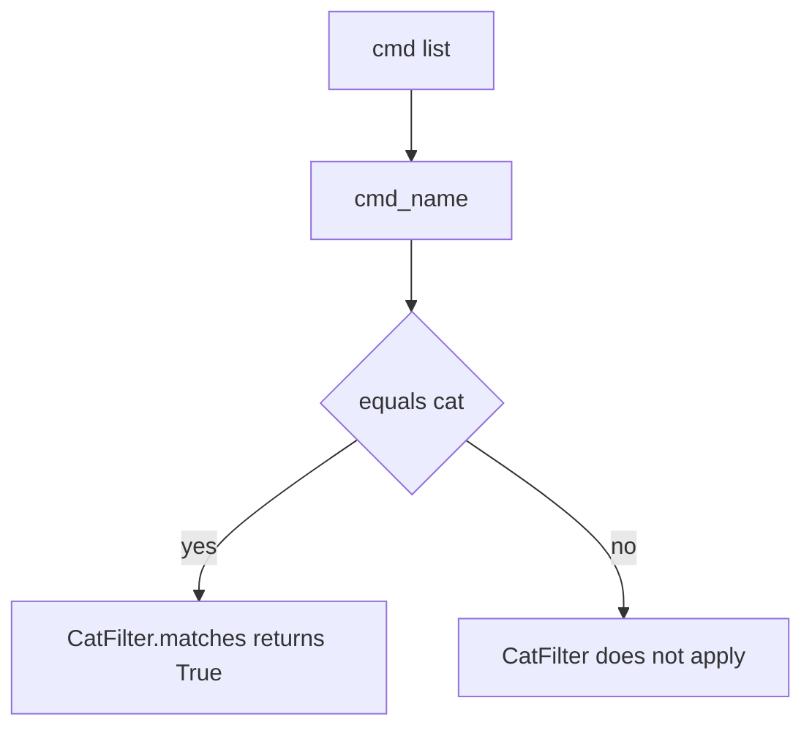
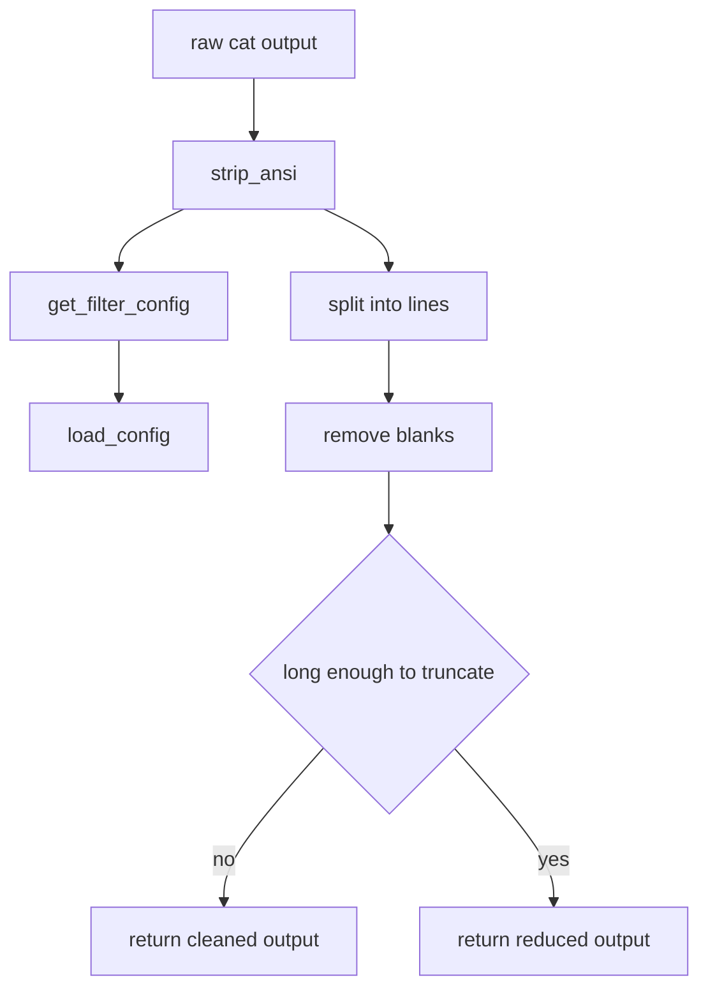

# Cat Filter

## Overview

The [`CatFilter`](src/pytk/filters/cat.py#L9) is a minimal example of the framework’s command-output filtering pattern. It is intentionally simple: it matches `cat` commands and reduces verbose file output by trimming blank lines and, for sufficiently long files, keeping only the most useful portions of the text. This makes it a good reference implementation for understanding how a filter is structured without the extra complexity of the larger filters in the repository.

The filter follows the same basic shape as the other filters in `src/pytk/filters/`, but its behavior is much narrower and easier to reason about. Its core entry points are [`CatFilter.matches`](src/pytk/filters/cat.py#L10) and [`CatFilter.filter`](src/pytk/filters/cat.py#L14), with [`CatFilter.savings_example`](src/pytk/filters/cat.py#L44) providing a small illustrative savings summary used by the CLI’s filter listing.

> **Sources:** `src/pytk/filters/cat.py` · L9–L49 · [`CatFilter`](src/pytk/filters/cat.py#L9) [`CatFilter.matches`](src/pytk/filters/cat.py#L10) [`CatFilter.filter`](src/pytk/filters/cat.py#L14) [`CatFilter.savings_example`](src/pytk/filters/cat.py#L44)

## Matching Rule

[`CatFilter.matches`](src/pytk/filters/cat.py#L10) uses the shared command-name utility [`cmd_name`](src/pytk/filters/base.py#L13) to decide whether the filter applies. In practice, the rule is simple: if the basename of the first command token is `cat`, the filter claims the command.

This makes the filter path-independent. A direct invocation like `cat README.md` and a prefixed or fully qualified form that still resolves to `cat` are treated consistently, because matching is based on the extracted command name rather than the raw command string.



> **Sources:** `src/pytk/filters/cat.py` · L10–L12 · [`CatFilter.matches`](src/pytk/filters/cat.py#L10) · `src/pytk/filters/base.py` · L13–L21 · [`cmd_name`](src/pytk/filters/base.py#L13)

## Filter Transformation

[`CatFilter.filter`](src/pytk/filters/cat.py#L14) is the transformation step. It first normalizes the output with [`strip_ansi`](src/pytk/filters/base.py#L8), then looks up filter-specific configuration via [`get_filter_config`](src/pytk/config.py#L66) and [`load_config`](src/pytk/config.py#L47). From there, it applies a compacting strategy:

- blank lines are removed,
- short files are left mostly intact,
- longer files are reduced to a smaller subset of lines, preserving the useful head/tail shape.

The implementation is deliberately constrained to the cat use case. Unlike more specialized filters elsewhere in the repository, this one does not branch into multiple subcommands or parse structured machine output. Its job is simply to return a smaller, cleaner text representation of the captured file content.



> **Sources:** `src/pytk/filters/cat.py` · L14–L42 · [`CatFilter.filter`](src/pytk/filters/cat.py#L14) · `src/pytk/filters/base.py` · L8–L10 · [`strip_ansi`](src/pytk/filters/base.py#L8) · `src/pytk/config.py` · L47–L68 · [`load_config`](src/pytk/config.py#L47) [`get_filter_config`](src/pytk/config.py#L66)

## Output Reduction Example

The repository’s tests show the intended reduction behavior in [`tests.test_filters_cat`](tests/test_filters_cat.py#L1). In particular, [`test_cat_truncates_long_file`](tests/test_filters_cat.py#L29) and [`test_cat_truncated_shows_head_and_tail`](tests/test_filters_cat.py#L37) demonstrate that long content is shortened rather than emitted in full.

A tiny illustrative example:

```text
Input:
1
2
3
4
5
6
7
8

Reduced output:
1
2
...
7
8
```

That example captures the key idea: the filter preserves enough context to remain useful while cutting the middle noise that would otherwise consume tokens. The exact truncation threshold and formatting are implementation details of [`CatFilter.filter`](src/pytk/filters/cat.py#L14), but the observable behavior is consistent with a head-and-tail reduction strategy.

## Savings Example

[`CatFilter.savings_example`](src/pytk/filters/cat.py#L44) provides the compact before/after summary used by `pytk list-filters`. The page does not need to expose a full benchmarking story; the important point is that the filter advertises a concrete reduction example so users can see that it is meant to reduce output volume, not merely reformat it.

For a minimal reference page, that is enough to understand the filter’s purpose: match `cat`, clean the output, and keep a smaller representative slice of the file content.

> **Sources:** `src/pytk/filters/cat.py` · L44–L49 · [`CatFilter.savings_example`](src/pytk/filters/cat.py#L44)