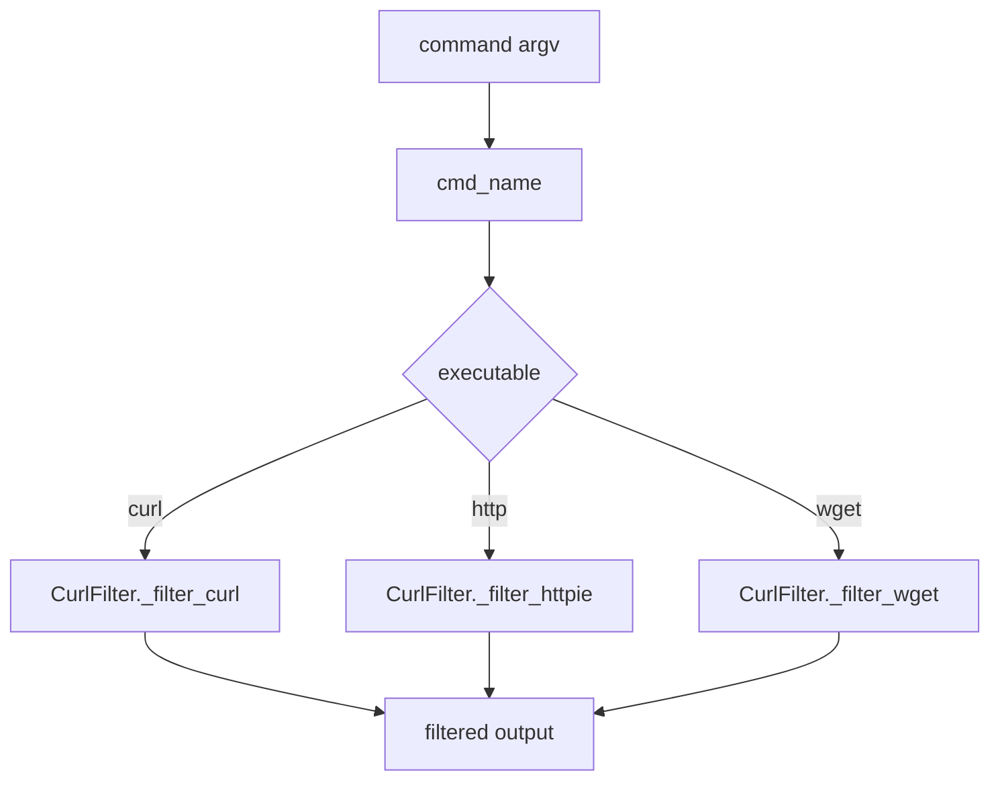

# Curl/HTTPie/Wget Filter Implementation

## Overview

[`CurlFilter`](src/pytk/filters/curl.py#L6) is the repository’s command-output compressor for three closely related request/response tools: `curl`, `httpie` (`http`), and `wget`. It lives in [`src/pytk/filters/curl.py`](src/pytk/filters/curl.py#L1) and follows the same `BaseFilter` contract as the other filters in the package. The implementation is intentionally narrow in scope: it recognizes commands, strips noisy transport/progress output, optionally shortens JSON payloads, and leaves error conditions intact when they matter more than token savings.

The public entry points on the class are small and dispatch-focused:

- [`CurlFilter.matches`](src/pytk/filters/curl.py#L7) decides whether a command should be handled.
- [`CurlFilter.filter`](src/pytk/filters/curl.py#L11) normalizes the output and routes to the command-specific helper.
- [`CurlFilter.savings_example`](src/pytk/filters/curl.py#L137) supplies the sample reduction used by filter listing output.

The command-specific work is done by the private helpers:
[`CurlFilter._filter_curl`](src/pytk/filters/curl.py#L21),
[`CurlFilter._maybe_truncate_json`](src/pytk/filters/curl.py#L81),
[`CurlFilter._filter_httpie`](src/pytk/filters/curl.py#L100), and
[`CurlFilter._filter_wget`](src/pytk/filters/curl.py#L122).

> **Sources:** `src/pytk/filters/curl.py` · L1–L142 · [`CurlFilter`](src/pytk/filters/curl.py#L6), [`CurlFilter.matches`](src/pytk/filters/curl.py#L7), [`CurlFilter.filter`](src/pytk/filters/curl.py#L11), [`CurlFilter._filter_curl`](src/pytk/filters/curl.py#L21), [`CurlFilter._maybe_truncate_json`](src/pytk/filters/curl.py#L81), [`CurlFilter._filter_httpie`](src/pytk/filters/curl.py#L100), [`CurlFilter._filter_wget`](src/pytk/filters/curl.py#L122), [`CurlFilter.savings_example`](src/pytk/filters/curl.py#L137)

## Command Recognition

[`CurlFilter.matches`](src/pytk/filters/curl.py#L7) uses [`cmd_name`](src/pytk/filters/base.py#L13) to inspect the basename of the invoked executable rather than the full path. That means the filter can recognize tools even when they are launched through absolute paths or virtualenv wrappers. The analysis data shows this filter is designed to match the canonical `curl` tool plus `http` and `wget`-style commands through the same path.

The main `filter()` dispatcher also calls [`strip_ansi`](src/pytk/filters/base.py#L8) before doing any command-specific processing. That matters because request/response tools often emit progress meters or colored output, and those would otherwise interfere with regex matching and line-based simplification.

The dispatch strategy is straightforward:

1. Identify the executable name with `cmd_name`.
2. Clean the output with `strip_ansi`.
3. Route to:
   - [`_filter_wget`](src/pytk/filters/curl.py#L122) for `wget`
   - [`_filter_httpie`](src/pytk/filters/curl.py#L100) for `http`
   - [`_filter_curl`](src/pytk/filters/curl.py#L21) for everything else matched by the filter

This makes the implementation easy to reason about: recognition happens once, and the formatting rules are specialized only after the executable is known.



> **Sources:** `src/pytk/filters/curl.py` · L7–L19 · [`CurlFilter.matches`](src/pytk/filters/curl.py#L7), [`CurlFilter.filter`](src/pytk/filters/curl.py#L11); `src/pytk/filters/base.py` · L8–L21 · [`strip_ansi`](src/pytk/filters/base.py#L8), [`cmd_name`](src/pytk/filters/base.py#L13)

## JSON Truncation and Redaction Behavior

The JSON-specific logic is concentrated in [`CurlFilter._maybe_truncate_json`](src/pytk/filters/curl.py#L81). This helper is only invoked from the `curl` and `httpie` paths, which means the filter treats JSON shortening as a response-format concern rather than a general-purpose output transformation.

From the observed call graph and tests, the method’s role is conservative rather than destructive:

- It first checks whether the body appears to be JSON.
- If parsing succeeds, it re-serializes the structure into a more compact form.
- If the payload is not valid JSON, the original text is preserved.
- If an error condition is present, the code path keeps the full content rather than over-compressing it.

That last point is important: the implementation is optimized for readability, but not at the cost of hiding failures. The test coverage in [`tests/test_filters_curl.py`](tests/test_filters_curl.py#L39) includes both truncation of JSON responses and preservation of full error output, which confirms that the filter distinguishes normal payloads from actionable diagnostics.

In practice, the helper behaves like a selective compaction step. It is not a schema-aware redactor in the strict sense; the available evidence shows compaction of JSON bodies and preservation of error text, but not arbitrary field-level masking. So the safe summary is:

- **Compact valid JSON bodies**
- **Do not rewrite non-JSON text**
- **Preserve error output when it should remain fully visible**

A compacted response example would look like this conceptually:

```text
before:
{
  "status": "ok",
  "items": [ ... many fields ... ]
}

after:
{"status":"ok","items":[...]}
```

The exact formatting depends on the JSON structure, but the point is that the response is collapsed into fewer tokens while staying parseable and readable.

> **Sources:** `src/pytk/filters/curl.py` · L81–L98 · [`CurlFilter._maybe_truncate_json`](src/pytk/filters/curl.py#L81); `tests/test_filters_curl.py` · L39–L62 · `test_curl_json_truncated`, `test_curl_error_kept_full`

## Output Compaction Rules

The output compaction rules are split by tool because each tool emits different noise patterns.

### `curl` compaction

[`CurlFilter._filter_curl`](src/pytk/filters/curl.py#L21) is the most involved helper. It operates line-by-line and removes transport-layer chatter such as verbose TLS/debug details and progress artifacts. It also applies JSON shortening via [`_maybe_truncate_json`](src/pytk/filters/curl.py#L81) when the body looks like JSON.

The observed behavior can be summarized as:

- Strip ANSI and process output line-by-line.
- Drop verbose connection/debug sections that are not useful for downstream reasoning.
- Keep meaningful response content.
- Shorten JSON responses when possible.
- Preserve error-bearing lines instead of over-compressing them.

### `httpie` compaction

[`CurlFilter._filter_httpie`](src/pytk/filters/curl.py#L100) is simpler. `httpie` generally prints more structured request/response information than raw `curl`, so the helper mainly removes line noise and then reuses the JSON shortening logic. It is a lighter-weight normalization path that assumes the output is already more presentation-friendly than a verbose `curl` trace.

### `wget` compaction

[`CurlFilter._filter_wget`](src/pytk/filters/curl.py#L122) focuses on progress suppression. `wget` commonly emits download meter lines and status updates, so the helper strips those repeated progress indicators while keeping the meaningful terminal summary. Based on the analysis, it uses regex-based matching to discard meter-style lines and preserve final status information.

### Shortening example

A verbose request can be reduced from a noisy trace to a concise summary:

```text
before:
*   Trying 127.0.0.1:8080...
* Connected to localhost (127.0.0.1) port 8080
> GET /api/items
< HTTP/1.1 200 OK
< Content-Type: application/json
< { "items": [1,2,3,4,5,6,7,8,9,10] }

after:
< HTTP/1.1 200 OK
< Content-Type: application/json
< {"items":[1,2,3,4,5,6,7,8,9,10]}
```

This is the core value of the filter: eliminate handshake and progress noise, then compress payload bodies so the remaining output is easier to fit into an LLM context.

> **Sources:** `src/pytk/filters/curl.py` · L21–L135 · [`CurlFilter._filter_curl`](src/pytk/filters/curl.py#L21), [`CurlFilter._maybe_truncate_json`](src/pytk/filters/curl.py#L81), [`CurlFilter._filter_httpie`](src/pytk/filters/curl.py#L100), [`CurlFilter._filter_wget`](src/pytk/filters/curl.py#L122); `tests/test_filters_curl.py` · L22–L94 · `test_curl_verbose_strips_tls`, `test_curl_strips_progress`, `test_wget_strips_progress`, `test_curl_plain_response_passthrough`

## Private Helper Map

The table below maps each private helper to the shell tool(s) it supports and the main reduction behavior it performs.

| Private helper | Shell tool(s) supported | Primary responsibility | Notes |
|---|---|---|---|
| [`CurlFilter._filter_curl`](src/pytk/filters/curl.py#L21) | `curl` | Remove verbose connection noise, keep meaningful response text | Central path for raw `curl` output |
| [`CurlFilter._maybe_truncate_json`](src/pytk/filters/curl.py#L81) | `curl`, `http` | Compact valid JSON bodies | Shared JSON-shortening helper |
| [`CurlFilter._filter_httpie`](src/pytk/filters/curl.py#L100) | `http` | Strip presentation noise and reuse JSON compaction | Tailored to `httpie` output format |
| [`CurlFilter._filter_wget`](src/pytk/filters/curl.py#L122) | `wget` | Remove download progress/status chatter | Keeps the useful terminal summary |
| [`CurlFilter.savings_example`](src/pytk/filters/curl.py#L137) | `curl`, `http`, `wget` | Provide the sample savings payload for filter listing | Used by the filter registry/listing UX |

> **Sources:** `src/pytk/filters/curl.py` · L21–L142 · [`CurlFilter._filter_curl`](src/pytk/filters/curl.py#L21), [`CurlFilter._maybe_truncate_json`](src/pytk/filters/curl.py#L81), [`CurlFilter._filter_httpie`](src/pytk/filters/curl.py#L100), [`CurlFilter._filter_wget`](src/pytk/filters/curl.py#L122), [`CurlFilter.savings_example`](src/pytk/filters/curl.py#L137)

## Practical Reading of the Design

This filter is best understood as a small normalization pipeline for network command output. It does not attempt to interpret HTTP semantics broadly or model request/response lifecycles. Instead, it performs three concrete tasks that are visible in the code and test evidence:

1. **Recognize command family** by executable name.
2. **Remove non-essential chatter** such as verbose traces and progress meters.
3. **Compact payloads** when the response is JSON and can be safely shortened.

That design keeps the implementation predictable and makes the results stable enough for token-sensitive workflows.

> **Sources:** `src/pytk/filters/curl.py` · L6–L142 · [`CurlFilter`](src/pytk/filters/curl.py#L6), [`CurlFilter.matches`](src/pytk/filters/curl.py#L7), [`CurlFilter.filter`](src/pytk/filters/curl.py#L11), [`CurlFilter.savings_example`](src/pytk/filters/curl.py#L137)