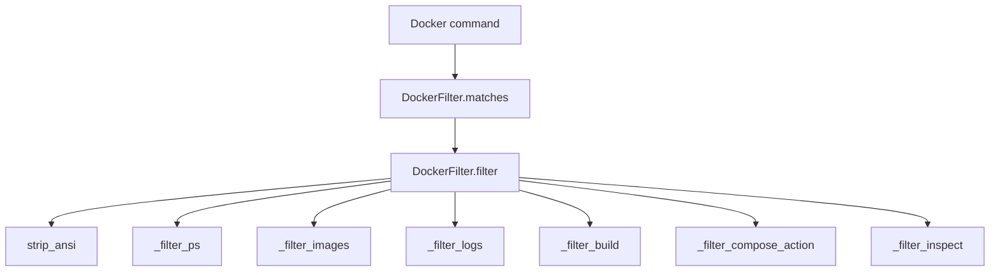

# Docker Filter Implementation

## Overview

The [`DockerFilter`](src/pytk/filters/docker.py#L6) is the Docker-specific output reducer in `pytk`. It recognizes both the classic `docker` CLI and the Docker Compose entry points exposed through the same binary family. In practice, [`DockerFilter.matches`](src/pytk/filters/docker.py#L7) routes commands whose executable name is `docker`, and the filter logic then inspects the subcommand and arguments to decide which normalizer to apply. The implementation covers the common output-heavy command families that tend to flood an LLM context: container listing, image listing, logs, build output, compose lifecycle actions, and object inspection. Those behaviors are all centralized behind [`DockerFilter.filter`](src/pytk/filters/docker.py#L11), which strips ANSI sequences first and then dispatches to a helper based on the command shape.

Recognized command families include:

- `docker ps` / `docker container ls` style container listings, normalized by [`DockerFilter._filter_ps`](src/pytk/filters/docker.py#L39)
- `docker images` / image listings, normalized by [`DockerFilter._filter_images`](src/pytk/filters/docker.py#L62)
- `docker logs`, normalized by [`DockerFilter._filter_logs`](src/pytk/filters/docker.py#L81)
- `docker build`, normalized by [`DockerFilter._filter_build`](src/pytk/filters/docker.py#L106)
- `docker compose up` / `down` / other compose actions, normalized by [`DockerFilter._filter_compose_action`](src/pytk/filters/docker.py#L143)
- `docker inspect`, normalized by [`DockerFilter._filter_inspect`](src/pytk/filters/docker.py#L172)

This filter is explicitly tuned for output reduction rather than semantic enrichment: it keeps the minimum useful fields and suppresses repetitive progress lines, verbose metadata, and noisy step-by-step logs. The public example used by `pytk list-filters` is exposed through [`DockerFilter.savings_example`](src/pytk/filters/docker.py#L202).

> **Sources:** `src/pytk/filters/docker.py` · L6–L207 · [`DockerFilter`](src/pytk/filters/docker.py#L6) · [`DockerFilter.matches`](src/pytk/filters/docker.py#L7) · [`DockerFilter.filter`](src/pytk/filters/docker.py#L11)

## Command Recognition and Dispatch

[`DockerFilter.matches`](src/pytk/filters/docker.py#L7) is intentionally narrow: it identifies commands by executable name using the shared [`cmd_name`](src/pytk/filters/base.py#L13) helper from the base filter layer. Once a command is accepted, [`DockerFilter.filter`](src/pytk/filters/docker.py#L11) performs family-based dispatch.

The dispatch order is observable from the method structure:

1. Clean the raw output with [`strip_ansi`](src/pytk/filters/base.py#L8)
2. Read filter configuration via [`get_filter_config`](src/pytk/config.py#L66) and [`load_config`](src/pytk/config.py#L47)
3. Determine command family using `cmd[1:]` and the first subcommand token
4. Call the matching helper:
   - [`DockerFilter._filter_ps`](src/pytk/filters/docker.py#L39)
   - [`DockerFilter._filter_images`](src/pytk/filters/docker.py#L62)
   - [`DockerFilter._filter_logs`](src/pytk/filters/docker.py#L81)
   - [`DockerFilter._filter_build`](src/pytk/filters/docker.py#L106)
   - [`DockerFilter._filter_compose_action`](src/pytk/filters/docker.py#L143)
   - [`DockerFilter._filter_inspect`](src/pytk/filters/docker.py#L172)

The design means the top-level filter stays small while the normalization rules remain isolated per output style. That is particularly useful for Docker because `ps` and `images` are columnar tables, `logs` are streaming text, `build` combines structured progress and failure messages, and `inspect` is JSON-like structured output.



> **Sources:** `src/pytk/filters/docker.py` · L7–L37 · [`DockerFilter.matches`](src/pytk/filters/docker.py#L7) · [`DockerFilter.filter`](src/pytk/filters/docker.py#L11) · [`DockerFilter._filter_ps`](src/pytk/filters/docker.py#L39) · [`DockerFilter._filter_images`](src/pytk/filters/docker.py#L62) · [`DockerFilter._filter_logs`](src/pytk/filters/docker.py#L81) · [`DockerFilter._filter_build`](src/pytk/filters/docker.py#L106) · [`DockerFilter._filter_compose_action`](src/pytk/filters/docker.py#L143) · [`DockerFilter._filter_inspect`](src/pytk/filters/docker.py#L172)

## Helper Methods and Normalized Command Families

The Docker filter’s helper methods are organized around the shape of the output rather than the exact CLI spelling. The table below summarizes what each helper normalizes.

| Helper method | Command family normalized | Primary reduction strategy |
|---|---|---|
| [`DockerFilter._filter_ps`](src/pytk/filters/docker.py#L39) | `docker ps`, container list output | Keep only `NAME | IMAGE | STATUS`; drop ID, command, created time, and ports |
| [`DockerFilter._filter_images`](src/pytk/filters/docker.py#L62) | `docker images` | Keep the repository/tag field only |
| [`DockerFilter._filter_logs`](src/pytk/filters/docker.py#L81) | `docker logs` | Strip ANSI, keep the tail, deduplicate repeated lines |
| [`DockerFilter._filter_build`](src/pytk/filters/docker.py#L106) | `docker build` | Remove step/cache noise, preserve errors and final image ID |
| [`DockerFilter._filter_compose_action`](src/pytk/filters/docker.py#L143) | Docker Compose `up` / `down` / action output | Compress to service name plus status |
| [`DockerFilter._filter_inspect`](src/pytk/filters/docker.py#L172) | `docker inspect` | Reduce JSON/object inspection to a compact subset |

The implementation makes a clear distinction between structural compression and contextual preservation. For example, image and container list reducers discard columns entirely, while the build reducer tries to preserve the evidence that something failed or that a final image was produced. Compose output is reduced to a concise event-style summary, which is enough for an LLM to reason about whether a service started, stopped, or failed without keeping every container lifecycle detail.

A notable detail is that [`DockerFilter.filter`](src/pytk/filters/docker.py#L11) also consults configuration through [`get_filter_config`](src/pytk/config.py#L66), which implies some of the aggressive truncation choices can be tuned by project config. The analysis data shows the configuration lookup path, but not the exact Docker-specific config keys, so the safest conclusion is that the filter is configuration-aware rather than hardcoded in every dimension.

> **Sources:** `src/pytk/filters/docker.py` · L11–L200 · [`DockerFilter.filter`](src/pytk/filters/docker.py#L11) · [`DockerFilter._filter_ps`](src/pytk/filters/docker.py#L39) · [`DockerFilter._filter_images`](src/pytk/filters/docker.py#L62) · [`DockerFilter._filter_logs`](src/pytk/filters/docker.py#L81) · [`DockerFilter._filter_build`](src/pytk/filters/docker.py#L106) · [`DockerFilter._filter_compose_action`](src/pytk/filters/docker.py#L143) · [`DockerFilter._filter_inspect`](src/pytk/filters/docker.py#L172) · `src/pytk/config.py` · L47–L68 · [`load_config`](src/pytk/config.py#L47) · [`get_filter_config`](src/pytk/config.py#L66)

## Worked Example: Log Reduction

[`DockerFilter._filter_logs`](src/pytk/filters/docker.py#L81) is the clearest example of the filter’s value. Its documented behavior is to strip ANSI codes, truncate to the last `N` lines, and deduplicate repeated lines. That combination is especially effective for container logs, which often include progress bars, repeated health checks, and colorized output that is unreadable in a chat transcript.

Consider a verbose log stream like this:

```text
service started
service started
service started
connecting to database
connecting to database
ready
ready
ready
```

After processing by [`DockerFilter._filter_logs`](src/pytk/filters/docker.py#L81), the result is reduced to a compact tail with repeated lines collapsed and ANSI escape codes removed. A representative reduced form would be:

```text
service started
connecting to database
ready
```

The key win here is not just shorter output; it is semantic clarity. The repeated lines that represent normal runtime chatter vanish, leaving only the distinct progression of the service. That makes the output far easier for an LLM to summarize, compare against prior runs, or reason about failure onset if one of the repeated lines were an error instead.

The same reduction principle applies to the other helpers: table outputs become one-line summaries, build logs shed progress noise, and inspect output is compressed into a smaller JSON fragment. The log case is simply the most obvious example because repetition and ANSI formatting are so common in real Docker workflows.

> **Sources:** `src/pytk/filters/docker.py` · L81–L104 · [`DockerFilter._filter_logs`](src/pytk/filters/docker.py#L81)

## Savings Example

The filter exposes a savings sample through [`DockerFilter.savings_example`](src/pytk/filters/docker.py#L202), which is consumed by the CLI’s filter listing command. In the overall `pytk` design, this method provides a human-readable before/after estimate so users can compare filters without reading implementation details. For Docker specifically, the example signals that the filter is intended to shave a meaningful amount of output from the most verbose command families.

Because the analysis data does not include the method body, we can only state what is observable: the method exists, is part of the `DockerFilter` public interface, and is used in the same pattern as the other filter classes’ savings examples. That makes it part of the filter’s documentation surface, not just its runtime behavior.

> **Sources:** `src/pytk/filters/docker.py` · L202–L207 · [`DockerFilter.savings_example`](src/pytk/filters/docker.py#L202)