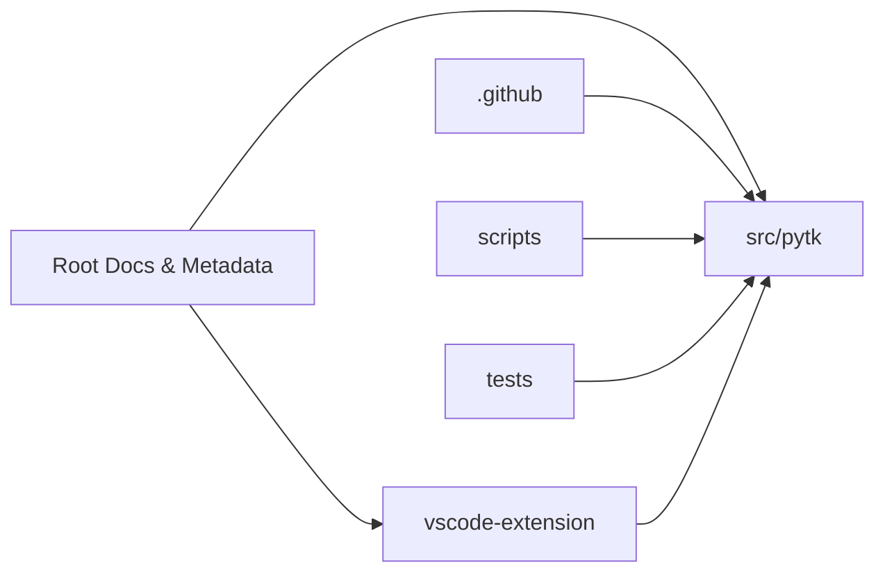

# Repository Map

## Annotated Tree

```text
.
├── README.md                 # Primary project overview and usage entry point
├── TUTORIAL.md               # Longer-form getting-started documentation
├── RELEASE-NOTES.md          # Release history and user-facing change log
├── pyproject.toml            # Python package metadata, tooling, and build config
├── AGENTS.md                 # Agent/operator guidance for working in the repo
├── CLAUDE.md                 # Claude-specific usage and project instructions
├── .gitignore                # Repository ignore rules
├── .github/                  # GitHub automation and contribution infrastructure
│   ├── copilot-instructions.md # Copilot guidance for code generation
│   └── workflows/
│       └── publish.yml       # Release/publish automation workflow
├── scripts/                  # Utility scripts and ad hoc automation
│   └── benchmark.py          # Benchmark entry point for comparing command handling
├── src/                      # Python source tree
│   └── pytk/                 # Core package
│       ├── __init__.py
│       ├── cache.py
│       ├── cli.py
│       ├── config.py
│       ├── doctor.py
│       ├── hook.py
│       ├── hooks/
│       │   ├── __init__.py
│       │   └── claude_hook.py
│       ├── runner.py
│       └── filters/
│           ├── __init__.py
│           ├── base.py
│           ├── cargo.py
│           ├── cat.py
│           ├── curl.py
│           ├── docker.py
│           ├── git.py
│           ├── grep.py
│           ├── kubectl.py
│           ├── lint.py
│           ├── ls.py
│           ├── make.py
│           ├── npm.py
│           ├── package_manager.py
│           ├── poetry.py
│           ├── registry.py
│           ├── terraform.py
│           └── uv.py
├── tests/                    # Python test suite covering CLI, filters, hooks, config, runner
│   └── test_*.py             # Module- and feature-focused test files
└── vscode-extension/         # TypeScript VS Code extension companion
    ├── package.json          # Extension manifest and dependency metadata
    ├── tsconfig.json         # TypeScript compiler configuration
    ├── README.md             # Extension-specific documentation
    ├── CHANGELOG.md          # Extension release notes
    ├── .vscodeignore         # Packaging exclusions
    └── src/
        ├── extension.ts      # Extension activation and UI wiring
        ├── filterEngine.ts   # Filter classification/decision logic
        └── statsProvider.ts   # Stats model and data provider
```

## Top-Level Repository Overview

This repository is structured as a mixed Python + TypeScript project with supporting Markdown, JSON, and XML assets. The Python package under [`src/pytk`](src/pytk) contains the primary implementation, the `tests/` directory provides behavioral coverage, and `vscode-extension/` packages a separate editor integration layer. Supporting docs and automation live at the root, under `.github/`, and in `scripts/`.

> **Sources:** `README.md` · `TUTORIAL.md` · `pyproject.toml` · `src/pytk/__init__.py` · `vscode-extension/package.json`

## Top-Level Directory Map

| Path | Type | Purpose | Key Symbols/Artifacts |
|------|------|---------|----------------------|
| `README.md` | Markdown | Main project landing page for users and contributors | Project overview, install/use guidance |
| `TUTORIAL.md` | Markdown | Longer-form tutorial and onboarding material | Step-by-step usage documentation |
| `RELEASE-NOTES.md` | Markdown | User-facing changelog | Release history and notable changes |
| `AGENTS.md` | Markdown | Operational instructions for agentic tooling | Repo-specific working guidance |
| `CLAUDE.md` | Markdown | Claude-specific instructions and conventions | Hook and usage notes for Claude workflows |
| `pyproject.toml` | TOML | Python build, packaging, and tool configuration | Package metadata, test/lint config, build settings |
| `.gitignore` | Text config | Git ignore rules | Local environment and build artifact exclusions |
| `.github/` | Directory | CI/CD and repository automation | [`publish.yml`](.github/workflows/publish.yml), Copilot guidance |
| `scripts/` | Directory | Utility and benchmarking scripts | [`benchmark.py`](scripts/benchmark.py) |
| `src/` | Directory | Python application source tree | [`pytk.cli`](src/pytk/cli.py), [`pytk.runner`](src/pytk/runner.py), filter modules |
| `tests/` | Directory | Automated test suite | `tests.test_cli`, `tests.test_runner`, filter tests |
| `vscode-extension/` | Directory | VS Code integration project in TypeScript | [`activate`](vscode-extension/src/extension.ts), [`FilterEngine`](vscode-extension/src/filterEngine.ts), [`StatsProvider`](vscode-extension/src/statsProvider.ts) |
| `.idea/` | Directory | IDE configuration files | XML project/settings files such as `modules.xml` and `inspectionProfiles/*.xml` |

> **Sources:** `AGENTS.md` · `CLAUDE.md` · `pyproject.toml` · `.github/workflows/publish.yml` · `scripts/benchmark.py` · `src/pytk/cli.py` · `src/pytk/runner.py` · `vscode-extension/src/extension.ts` · `.idea/inspectionProfiles/Project_Default.xml`

## Key Top-Level Areas

### `src/`: Core Python Package

The `src/` tree contains the main package, [`pytk`](src/pytk), which is the implementation center of the repository. The package is organized into focused modules: [`cli.py`](src/pytk/cli.py) provides command-line entry points and subcommands, [`runner.py`](src/pytk/runner.py) handles command execution and dispatch, [`config.py`](src/pytk/config.py) manages configuration loading and merging, [`hook.py`](src/pytk/hook.py) manages shell hook enable/disable/status operations, [`doctor.py`](src/pytk/doctor.py) reports environment health, and the `filters/` package defines the reusable filter registry and command-specific filters.

The source tree also includes [`hooks/claude_hook.py`](src/pytk/hooks/claude_hook.py), which is the main hook entry-point observed in the analysis data, and [`cache.py`](src/pytk/cache.py), which stores and queries cache state used by the runtime.

> **Sources:** `src/pytk/cli.py` · `src/pytk/runner.py` · `src/pytk/config.py` · `src/pytk/hook.py` · `src/pytk/doctor.py` · `src/pytk/cache.py` · `src/pytk/hooks/claude_hook.py` · `src/pytk/filters/base.py` · `src/pytk/filters/registry.py`

### `tests/`: Behavioral Coverage

The `tests/` directory mirrors the Python implementation with feature-oriented test files. The suite includes coverage for ANSI stripping, cache behavior, CLI parsing and output formats, configuration precedence, doctor diagnostics, dry-run behavior, each command filter, hook enable/disable/status workflows, agent initialization, registry routing, and runner execution.

This layout suggests a strong focus on validating observable behavior rather than exposing internal implementation details. Test file names map closely to the package modules they verify, which makes the suite easy to navigate and maintain.

> **Sources:** `tests/test_cli.py` · `tests/test_runner.py` · `tests/test_filters_git.py` · `tests/test_hook.py` · `tests/test_init_agents.py` · `tests/test_gain_export.py`

### `vscode-extension/`: TypeScript Companion

The `vscode-extension/` directory is a separate TypeScript project that integrates with VS Code. Its core files are [`extension.ts`](vscode-extension/src/extension.ts), which defines extension activation and UI updates; [`filterEngine.ts`](vscode-extension/src/filterEngine.ts), which encapsulates command/filter analysis logic; and [`statsProvider.ts`](vscode-extension/src/statsProvider.ts), which models and serves statistics data through the extension UI.

This area is clearly a companion module rather than a replacement for the Python package: it has its own `package.json`, compiler configuration, and docs. That separation keeps the editor integration deployable independently from the Python runtime.

> **Sources:** `vscode-extension/package.json` · `vscode-extension/tsconfig.json` · `vscode-extension/src/extension.ts` · `vscode-extension/src/filterEngine.ts` · `vscode-extension/src/statsProvider.ts`

### `.github/`: Automation and Contribution Support

`.github/` contains repository automation. The visible workflow file [`publish.yml`](.github/workflows/publish.yml) indicates release or publishing automation, and [`copilot-instructions.md`](.github/copilot-instructions.md) provides AI coding guidance for contributors and tooling.

This directory does not appear to contain application code, but it is important for CI/CD and for shaping how automated agents interact with the project.

> **Sources:** `.github/copilot-instructions.md` · `.github/workflows/publish.yml`

### Root Metadata and Documentation Files

Several root-level files define the project’s identity, packaging, and support workflow. [`pyproject.toml`](pyproject.toml) is the primary Python project metadata file. The Markdown documents [`README.md`](README.md), [`TUTORIAL.md`](TUTORIAL.md), and [`RELEASE-NOTES.md`](RELEASE-NOTES.md) provide user and contributor documentation. [`AGENTS.md`](AGENTS.md) and [`CLAUDE.md`](CLAUDE.md) provide meta-instructions for agentic or assistant-driven workflows.

Together, these files indicate a project that is intentionally documented both for humans and for tools.

> **Sources:** `README.md` · `TUTORIAL.md` · `RELEASE-NOTES.md` · `AGENTS.md` · `CLAUDE.md` · `pyproject.toml`

## Mixed-Language and File-Type Notes

This repository is not purely Python. It combines:

- **Python** for the main package, scripts, and tests
- **TypeScript** for the VS Code extension
- **Markdown** for user docs, release notes, and contributor guidance
- **TOML** for Python project configuration
- **JSON** for Node/TypeScript extension metadata in `vscode-extension/package.json`
- **XML** for IDE/project settings under `.idea/`

That mix implies two build/tooling surfaces: Python packaging/testing on one side and Node/TypeScript extension development on the other. The non-code documentation files are also first-class citizens in the repository structure, which is useful for onboarding and release management.

> **Sources:** `pyproject.toml` · `vscode-extension/package.json` · `vscode-extension/tsconfig.json` · `.idea/modules.xml` · `.idea/inspectionProfiles/Project_Default.xml`

## Top-Level Dependency Sketch

The repository’s top-level areas can be understood with a simple dependency-style view:



This graph is intentionally coarse: it shows top-level influence and integration points only, not internal call chains. The core runtime remains the Python package in `src/pytk`, while the test suite validates it and the VS Code extension consumes related concepts in a separate toolchain.

> **Sources:** `scripts/benchmark.py` · `src/pytk/cli.py` · `src/pytk/runner.py` · `tests/test_runner.py` · `vscode-extension/src/extension.ts` · `.github/workflows/publish.yml`

## What This Map Does and Does Not Cover

This page is a repository map, so it focuses on structure and contribution boundaries rather than implementation detail. It intentionally avoids deep-diving into filter algorithms, CLI subcommand semantics, or individual hook mechanics. For those details, the module-level documentation pages should be used instead.

The main takeaway from the tree is that the repo is organized around a central Python command-processing engine, with tests and a VS Code extension as adjacent consumers, and with documentation/automation layered around that core.

> **Sources:** `src/pytk/cli.py` · `src/pytk/runner.py` · `vscode-extension/src/filterEngine.ts`